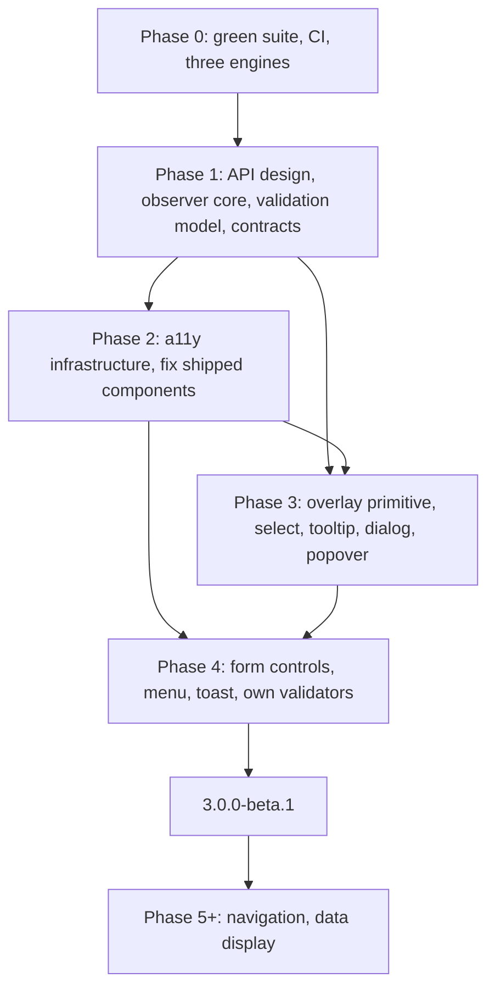

> Dated research and proposals. These records are evidence; the owning quest specs define current decisions and authorized work.

# buntpapier v3: next plan

Status: draft, 2026-09-16. Written against `3.0.0-alpha.18`, checkout `3efdbaf`. Every source claim in section 4 was re-checked against the working tree on 2026-09-16; what I could not verify is marked as such.

## TL;DR

Three things block a beta. The shipped components are not accessible: the select has zero ARIA, the calendar grid is unreachable from the keyboard, checkbox and tooltip fail basic checks. The component set is too small to build an app with. And the foundations have drifted: the style observer core has not moved since 2023 and polls or relies on a global mutation observer, vuelidate's object shape is hardwired into input and select, two positioning libraries ship side by side, and the date-picker Playwright suites are red against the current markup.

The plan runs in six phases. Phase 0 restores ground truth (tests green, CI, browser matrix). **Phase 1 is a design phase**: it refines the API philosophy for the components that come next, evaluates `style-observer` as the new reactivity core, retires vuelidate in favour of our own validation model, and writes the field, overlay, strings and behaviour contracts once. Phases 2 to 4 implement: cross-cutting accessibility infrastructure and fixes to shipped components, then one overlay primitive on the Popover API and CSS anchor positioning with select, tooltip, dialog and popover rebuilt on it, then the missing form controls and overlays. Beta.1 tags at the end of Phase 4. Navigation and data display follow after.

We write the behaviour layer ourselves. Every Vue headless core hard-wires floating-ui and its own layering stack, and the platform now does positioning, layering, light dismiss and modal inertness for us. The residual behaviour code is roughly 850 lines of composables.

## 1. Decisions taken

Settled for this plan. Everything else is in section 12.

| decision | choice | consequence |
|---|---|---|
| browser baseline | Baseline "newly available" as of 2026-04: Chrome 147+, Firefox 147+, Safari 26+. No legacy support. | Popover API, `<dialog>`, `command`/`commandfor`, `field-sizing`, `contrast-color()`, `light-dark()`, `@starting-style`, CSS anchor positioning core subset, `transition-behavior: allow-discrete`. README currently says Firefox 146; anchor positioning needs 147, so the README moves to 147. |
| accessibility target | WCAG 2.2 AA. Each interactive component maps to a WAI-ARIA APG pattern or is a native element. | Definition of done in section 7.1. axe with the `wcag22aa` tag, aria snapshots, keyboard tests, one manual screen reader pass per component. The library publishes scoped test evidence, not a conformance promise for the host app. |
| behaviour layer | in-house composables under `src/composables`, internal for now | Section 9. No headless core. `focus-trap` is the only acceptable dependency, and only if a non-modal contained-focus case appears. |
| component authoring | ordinary components by default; optional primed components for async workflows and complex integrations | Agreed in Phase 1.3, 2026-09-18. Each priming composable call binds one shared logical state; its returned component is a functional view over that closure. Workflow state survives view unmounts until the owning scope is disposed. Ordinary components retain props/models and local async convenience, including the button's async click handling. No mandatory `useX()` per form field. [Decision and alternatives](../../../design/api-design.md). |
| positioning and layering | CSS anchor positioning, in-tree popovers, native `<dialog>` | `@floating-ui/vue` and `@popperjs/core` go. The `#bunt-teleport-target` requirement goes. The select theme-forwarding hack goes. |
| validation | own validation model, Vuelidate support removed outright | Section 6. `invalid` and `errors` carry application feedback; form authoring and rule binding are under discussion in [Phase 1.4](../../validation-forms/spec.md). Remove the legacy `validation` prop without a migration phase. |
| presentation API | CSS custom properties configure appearance and presentation policy, including live changes to modality and dismissal while open. Props/models carry content, application state and data. | Phase 1.3 supersedes the broad "behaviour in props" rule. JavaScript applies the native behavior required by resolved CSS presentation settings as they change. Section 5 refines the contracts. |
| state styling | style the semantics | Where a native or ARIA state exists (`:popover-open`, `:modal`, `:checked`, `:user-invalid`, `[aria-expanded]`, `[aria-selected]`, `:disabled`, `:focus-visible`), Sass selects on it, not on a parallel class. Classes remain for CSS-property-driven variants (`bunt-button--shape-pill`) and purely visual state (`.floating-label`). |
| milestone scope | form controls and overlays, then beta.1 | Navigation and data display are later phases and are listed as an appendix, not as commitments. |

Legal context, briefly: the European Accessibility Act applies since 2025-06-28, transposed in Germany as the BFSG. The harmonised standard is EN 301 549 v3.2.1, which references WCAG 2.1 AA. The September 2026 research reported v4.1.1 with WCAG 2.2 as published in September 2026 but not yet cited in the Official Journal; I could not re-verify that in this session. We target 2.2 AA either way, it is a superset.

## 2. Roadmap

Phases are ordered by dependency. No calendar dates; each phase has an exit criterion.

### Phase 0: ground truth

Small and mechanical. Everything after it builds on a green suite.

1. Repair the date-picker and date-range-picker Playwright suites. They query `td`, `th` and `table[role=grid]` and expect a dotted date; the calendar renders `div` roles and the input shows ISO. Decide intended behaviour per assertion, then fix the test or the component. Do not loosen assertions to bless the current state.
2. Add Chromium, Firefox and WebKit projects to `playwright.config.ts`. We cite Safari quirks throughout this plan and never run WebKit.
3. Add a GitHub Actions workflow: lint, build, docs build, Playwright on all three engines.
4. Delete `src/components/date-picker/date-picker copy.vue` and `src/styles/typography.styl` (not imported anywhere). Move `color-blend` from devDependencies to dependencies or inline the blend function; it is imported at runtime in `src/utils/colors.ts`.
5. Fix the README browser floor (Firefox 147).
6. Reconcile TODOs.md: items 1 to 3, 6 and 7 are done, A is this plan.

Exit: all five suites green on three engines in CI.

### Phase 1: API design and primitives

The design phase. Output is documents, spikes and ADRs, plus a working prototype of the new style observer core once item 1 resumes. No component ships from this phase.

1. **Style observer core.** **Deferred 2026-09-18.** The spike ran on Chromium 147 and Firefox 148; findings, the option matrix and what would settle it are in [observer findings](../../style-observer/spec.md). WebKit and a prototype behind `useComputedStyle` are still missing. Original scope: evaluate `style-observer` (observe.style) as the replacement for `computedStyle.ts`, `themeWatcher.ts` and `requestAnimationFrameMuxxer.ts`, section 5.2 has the pre-spike analysis. `useComputedStyle` keeps its call signature whatever the outcome.
2. **JS bridge inventory.** **Completed 2026-09-18.** [The inventory](../../../design/js-bridge-inventory.md) records source locations, native replacements, support status and retirement conditions, including scrollbars, ripple geometry, checkbox icon lookup and overlay theme forwarding. Implementation stays in the assigned later phases; the outline prototype belongs to the field contract work.
3. **API philosophy update.** **Design record completed 2026-09-18.** [Decisions, alternatives and shared field vocabulary](../../../design/api-design.md) cover ordinary and primed components, shared workflow state/lifetime, live CSS presentation, clear controls, icons and calendar settings. The [evergreen internal API guide](../../../design/api-guide.md) explains the authoring model. Per the owner's direction, narrative public docs stay human-written; this guide lives in `design/` and is linked from `AGENTS.md`. Implementation mechanics remain in Phase 1.5.
4. **Validation model.** **Deferred by the owner, 2026-09-18.** Own form/validation orchestration, `useForm` direction and direct Vuelidate removal are settled. [Validation/forms](../../validation-forms/spec.md) preserves template alternatives, behavior proposals and resume questions. Consider Valibot/Zod-style schemas and inferred types before fixing the definition API; no schema dependency is selected. Independent contract work can proceed according to the recorded dependency assessment. Section 6 remains the initial proposal.
5. **Contracts.** Write the four internal contracts before any composite lands: field wiring, overlay lifecycle, selection model, initialization/strings. [Contract work and inherited requirements](../spec.md#subquests) assign native modality transitions, focus preservation, primed-view attachment/multiple mounts and app-scoped reactive locale configuration. Each completed contract needs its internal signature, emitted semantics and verification evidence. Section 9 lists the candidate composables. Field wiring depends on Phase 1.4's behavior decisions.
6. **Select and Combobox naming.** Decide the taxonomy. Section 12, question 1.
7. **Packaging.** Add a declaration build and a `types` entry, decide on individual component exports and SSR-safe module init (`requestAnimationFrameMuxxer.ts` and `themeWatcher.ts` already guard on `import.meta.env.SSR`; the new core must too).

Exit: ADRs for items 3, 4 and 6 accepted, item 1 deferred (see [observer findings](../../style-observer/spec.md)); the four contracts written; a `types` entry ships in the next alpha. The prototype criterion for the observer core (passes the dark-mode and light-dark token suites on three engines) moves with item 1.

### Phase 2: infrastructure and shipped-component fixes

Deliverables: section 7.2 items 1 to 12, section 7.3 fixes 3 to 9, the test fixtures from section 10, the accessibility guide page and the per-component Accessibility section template. The style observer core swap waits for the deferred Phase 1 item 1.

Exit: button, checkbox, input, progress and both date pickers pass the definition of done. Calendar grid reachable from the keyboard. axe and aria snapshots run in CI. Own validation model in place, Vuelidate support and the legacy `validation` prop removed, public validation docs reflect the replacement.

### Phase 3: overlay primitive

Deliverables: `useOverlay`, `useDialog`, `useDismiss`; `bunt-tooltip` with `v-tooltip` kept as sugar; `bunt-dialog`; `bunt-popover`; `bunt-select` rewritten on the primitive with full combobox semantics. Remove `@floating-ui/vue`, `@popperjs/core` and the `#bunt-teleport-target` requirement. Migration note in the docs.

Exit: no third-party positioning code in the bundle. Select, tooltip, dialog and popover pass the definition of done including one manual screen reader pass each.

### Phase 4: form controls and remaining overlays

Deliverables: `bunt-field`, `bunt-textarea`, `bunt-number-input`, `bunt-radio` and `-group`, `bunt-checkbox-group`, `bunt-switch`, `bunt-slider`, `bunt-combobox`, `bunt-menu`, `bunt-toast`. Own validators complete, `validation` prop removed. German strings dictionary complete. Two integrated examples in the docs: a settings form with validation and async save, and a searchable record list with an edit dialog and confirmation.

Exit: every component in section 8.1 passes the definition of done. Both examples work with keyboard, NVDA and VoiceOver. Tag `3.0.0-beta.1`.

### Phase 5 and later

Navigation and layout first (tabs, disclosure and accordion, breadcrumbs, pagination, toolbar), then data display (table, chips, badge, skeleton, linear progress, empty state), then more pickers. Appendix A has the long list with the recipe-versus-component call for each entry. Planned separately once Phase 4 is out.

### Dependency outline

## 3. Kill list

Things that leave the codebase during this plan, with the phase that removes them.

| what | why | phase |
|---|---|---|
| `date-picker copy.vue`, `typography.styl` | dead files | 0 |
| red date-picker suites | selectors target markup that no longer exists | 0 |
| `@popperjs/core` | tooltip positioning; replaced by anchor positioning | 3 |
| `@floating-ui/vue` | select positioning; replaced by anchor positioning | 3 |
| `#bunt-teleport-target` and `dropdownThemeStyle` | in-tree popover inherits the theme context | 3 |
| the mirrored input strip inside the select dropdown | in-tree dropdown does not need to redraw the field | 3 |
| Vuelidate-shaped `validation` prop (`$error`, `$errors`, `$touch`) in input and select | replaced by own validation model without a migration phase | 2 |
| `docs/validation.md` as written | imports a path that does not exist | 2 |
| `requestAnimationFrameMuxxer.ts` and the `--bunt-will-change` polling opt-in | replaced by transition-event observation | deferred with Phase 1 item 1 |
| `themeWatcher.ts` and the exported `refreshComputedStyles()` | replaced by per-element observation of `--_clr-surface`; the manual refresh footgun disappears | deferred with Phase 1 item 1 |
| hardcoded English strings in date pickers and select | strings dictionary | 2 |
| `--clr-*-text-light` / `-dark` deprecated tokens | already replaced by derived tokens | beta.1 |

Not on the list: `color` (still needed for the contrast guard, no platform parser yet), `@js-temporal/polyfill` (Safari has no Temporal), `@vue-macros/reactivity-transform` (see section 12, question 10).

## 4. Current state

Audit of `src/` at alpha.18, re-verified 2026-09-16.

| component | what is there | gaps |
|---|---|---|
| `bunt-button` | native `<button type>`, `:focus-visible` ring, `aria-disabled` mirrored (stays focusable, click guarded), error tooltip force-shown while `errorMessage` is set | icon-only buttons have no accessible name (TODO in `button.ts`). Loading, success and error are visual only: no `aria-busy`, nothing announced. Router-link variant keeps `href` while `aria-disabled`. Text and outlined weights guard their ink at 3:1 (`button.ts:89`), text needs 4.5:1. |
| `bunt-checkbox` | native `<input type=checkbox>` inside `<label>` | `focused` tracked, no focus rule anywhere in `checkbox.sass`. `readonly` forwarded to a checkbox, which ignores it. No indeterminate. No hint or error wiring. Outlined ink also guarded at 3:1. |
| `bunt-input` | native `<input>` in `<label>`, hint, vuelidate-shaped validation, SVG outline | hint and error text not linked (`aria-describedby`), no `aria-invalid`, error icon carries only `title`. `name`, `autocomplete`, `inputmode`, `required` never reach the inner input; attrs fall through to the wrapper. Compact size hides `.hint`, which is where errors render (`input.sass:137`). |
| `bunt-select` | Up, Down, Enter, Escape on the input, type-to-filter, grouped options, `inheritAttrs: false` with `$attrs` bound on the root (fallthrough classes work; TODOs #7 is stale) | zero ARIA: no `role=combobox`, `aria-expanded`, `aria-controls`, `aria-activedescendant`; options are `<li>` without `role=option`. Dropdown teleports to `#bunt-teleport-target`, breaking reading order and needing the theme-forwarding hack. Home, End, PageUp, PageDown missing. "No options" not announced. Label hidden while open, so the name changes mid-interaction. |
| `bunt-date-picker` | `role=combobox`, `aria-haspopup=dialog`, `role=grid` on `div`s, `aria-live` month label, native `popover=manual`, Escape, Alt+Down, segmented ISO editing, `useId` for the popover id | **The calendar is mouse-only.** Every day button has `tabindex=-1` because `autoFocus` is never passed to `CalendarMonth` (`CalendarMonth.vue:214`); prev/next and preset buttons are `tabindex=-1` too, so Tab skips the whole popover. `aria-selected` sits on the button, not the `gridcell`. `id="dp-month-label"` is static and the calendar label id is keyed by month only, so two pickers collide. `inline` and `clearable` are declared and documented but the template has neither branch; `handleClear` is dead code. Strings hardcoded English. |
| `bunt-date-range-picker` | same base, two-click selection, hover preview, working `inline` and `clearable` branches, nav buttons are normal tab stops | day grid mouse-only for the same reason. No start/end announcements. Range input is readonly. Same id and string issues. |
| `bunt-progress-circular` | SVG spinner | no `role=progressbar`, no determinate mode, no reduced-motion handling |
| `bunt-scrollbars` | custom thumbs over a native scroll container | thumbs mouse-only, fine while the container stays keyboard-scrollable. `scrollbar-width` and `scrollbar-color` are Baseline; replacement spike later. |
| `v-tooltip` | `mouseenter`/`mouseleave`, popper | no focus trigger, no Escape, no `role=tooltip`, no `aria-describedby`. Fails WCAG 1.4.13. |
| `v-ripple-ink` | decorative | ignores `prefers-reduced-motion` |
| global | surface tokens, `contrast-color()` for filled text, `light-dark()` accents, registered `--_` mirrors for the JS bridge | no focus ring token, no `prefers-reduced-motion` or `forced-colors` anywhere, `.sr-only` defined only inside `date-picker.sass`, no strings mechanism, no a11y checks in Playwright, Chromium only, no CI, no `types` entry, no declaration build |
| tests | five suites: dark-mode, light-dark tokens, select groups, date picker, date range picker | the two date suites do not match the source (see Phase 0). The contrast tests assert 3:1 for text-weight ink. |
| docs | why, theming, getting started, per-component pages with `ApiDocs` and `Showcase` | `validation.md` imports `buntpapier/src/vuelidate/validators`, which does not exist. Radio, switch, tabs are "NOT YET IMPLEMENTED" stubs. Components index is empty. CLAUDE.md still documents the HSL `--_button-bg-h/s/l` decomposition; `button.sass` moved to relative color syntax (`hsl(from var(...) h s calc(l * x))`) and `button.ts` no longer writes those vars. |

## 5. API design and the style observer core

This is the Phase 1 content. The rest of the plan assumes its outcomes but does not depend on a specific answer for the observer core: `useComputedStyle` keeps its signature either way.

### 5.1 JS bridge inventory

The source audit and decisions are in [JavaScript bridge inventory](../../../design/js-bridge-inventory.md), completed 2026-09-18. It replaces the first-pass table here.

Colour channel derivation and filled-label contrast already run in CSS. Keep keyword classes until `if()` reaches our browser floor; keep accent contrast correction until native target-contrast selection can replace it. Checkbox icon lookup is a separate bridge that `if()` does not remove. The observer decision remains deferred with item 1.

Retire select/tooltip geometry and select theme forwarding with the Phase 3 overlay rewrite. Check native scrollbars in Phase 2 before retiring both custom implementations. Keep pointer-origin ripple geometry and the current SVG outline. `field-sizing` and `anchor-size()` do not directly replace the notch; the field contract work must prototype the replacement before new field types adopt that helper.

### 5.2 Style observer core

**Status 2026-09-18: deferred.** The spike ran; [observer findings](../../style-observer/spec.md) has the findings and options. The text below is the pre-spike analysis, kept for context. Where it conflicts, the design doc wins: crbug 360159391 is fixed in Chromium 147, the unset-to-set gap affects Chromium and Firefox alike and is the open spec issue csswg-drafts #10962, and any transition-based observer needs the observed public tokens registered with an `initial-value`.

`computedStyle.ts` dates from 2023-07 and was touched once since, to hook in the theme watcher. It reads the mapped properties once on mount, again when `<html>` or `<body>` change `class`, `style` or `data-theme` or the OS scheme flips, and per animation frame if the element opts in with `--bunt-will-change: all`. A theme toggle deeper in the tree is invisible; the theming guide tells apps to call `refreshComputedStyles()` by hand. That is the footgun to remove.

**observe.style** is Lea Verou's `style-observer` (MIT, ESM-only, no dependencies, npm `style-observer` 0.1.2). It detects computed-value changes of any CSS property on any element, including custom properties, with transition events: it appends a near-zero transition for the observed properties with `transition-behavior: allow-discrete` and listens for `transitionstart`. Records carry `target`, `property`, `value`, `oldValue`. API: `new StyleObserver(callback, { targets, properties, throttle })`, `observe(targets, properties)`, `unobserve()`, `updateTransition(targets)`. It detects and works around three engine bugs: a Safari transition loop, Chrome not transitioning unregistered custom properties (it registers them via `@property` in a cascade layer), and Firefox not firing the initial event. Since 0.0.7 it also catches changes caused by reconnection and `display` toggles. Support floor is Chrome 117, Safari 17.4, Firefox 129, well inside our baseline. Sources: [observe.style](https://observe.style/), [README](https://github.com/LeaVerou/style-observer), [announcement post](https://lea.verou.me/blog/2025/style-observer/), releases page.

What it would give us:

- Per-element change detection for `--_clr-surface`, `--_button-color` and the keyword variants, wherever the change originates: an ancestor's `color-scheme`, a class toggle on a wrapper, a stylesheet swap, a media query. `themeWatcher.ts`, `refreshComputedStyles()` and the rAF loop all go.
- Correct behaviour for the per-subtree theming the docs already advertise, without the manual refresh.
- No polling. The current rAF loop calls `getComputedStyle` per frame per opted-in element, which is the "prohibitively slow" path the library exists to replace.

What it costs and what to check in the spike:

1. **Registration side effects.** To make Chrome transition unregistered custom properties, the library registers them. Our public tokens are unregistered on purpose so `light-dark()` stays live down the tree (`derived.sass` header comment), and the whole styling API relies on inheritance (`.sidebar .bunt-button { --button-weight: text }`). Verify with which `syntax` and `inherits` the library registers, and that a `*` syntax registration keeps token streams unresolved and inheriting. If it registers `inherits: false`, it is unusable for us as-is and we register our observed public properties ourselves first.
2. **Transitions on component roots.** The library needs its transition on the observed element. Button, checkbox, input and the ripple set their own `transition` in Sass. The documented escape is appending `var(--style-observer-transition, --style-observer-noop)` to every transition declaration on an observed root, or calling `updateTransition()` after changes. Count today: three declarations in checkbox, three in input, one in date-picker, four in ripple-ink. Manageable, but it becomes a convention every future component follows.
3. **Latency.** Transition events fire after style recalc, so a change is observed one frame later than a synchronous `getComputedStyle` read. First paint still needs the synchronous read on mount because the observer does not fire for initial values. Check for a flash on theme flip in the dark-mode suite.
4. **Maturity.** Version 0.x, last release 2025-10-08, about eleven months before this plan. Bus factor is two people. The implementation is small and MIT, so the fallback is to fork or reimplement the trick in-house once the browser bugs it works around are gone. Decide based on the spike, not on the version number.
5. **SSR.** The module must be importable without `document`. Our current core guards on `import.meta.env.SSR`.

Recommendation going into the spike: adopt, wrapped in `useComputedStyle` so components see no change, with our own `@property` registrations for every observed public property so the library never registers on our behalf. If the spike fails on point 1 or 3, implement the transition-event trick ourselves; it is roughly a hundred lines without the browser bug matrix and our baseline avoids most of that matrix.

### 5.3 API philosophy for the new families

The refined rule is: **presentation in CSS custom properties; content, application state and data in props/models; rendered state exposed through native semantics and ARIA.** Presentation includes modality and dismissal policy. Their interaction consequences are implemented by JavaScript and native elements.

Phase 1.3 agreement, 2026-09-18: ordinary components remain the default, including form controls with reactive props/models and buttons with local async feedback. Optional composables return primed components for async workflows or complex integrations; each call binds one shared logical state. The returned component behaves as a functional view over the closure; workflow lifetime belongs to the composable's scope and survives view unmounts. Data shape and frequency of change do not determine whether something may be a prop. Modality and dismissal belong in CSS and update live, including while open. Exact token names, value grammar and native mode transitions remain open. [Discussion and alternatives](../../../design/api-design.md).

| concern | mechanism | example | why |
|---|---|---|---|
| placement and size of an overlay | custom property | `--popover-placement: block-end span-inline-start`, `--dialog-size: large`, `--tooltip-offset: 8px` | placement is layout; it cascades (all menus in a sidebar open to the right) and maps one to one onto `position-area` and `position-try-fallbacks` |
| modality and what dismisses an overlay | CSS custom property | candidate syntax: `--dialog-modal: true`, `--dialog-dismiss: outside escape` | presentation policy follows selectors and the cascade live, including while open; JavaScript applies corresponding native behavior and semantics. Token spelling and native transition details remain to be decided |
| open state | `v-model:open` mirroring the element | `<dialog>` fires a non-cancellable `close`, so the model follows the element rather than driving it | matches the platform, avoids the Radix problem |
| visual state | native and ARIA selectors | `.bunt-select:has([aria-expanded="true"])`, `input:user-invalid`, `[popover]:popover-open` | one source of truth for AT and CSS; no `.open` class to keep in sync |
| CSS-property-driven variants | modifier class written by the bridge | `bunt-button--shape-pill` | CSS cannot branch on its own custom property yet (5.1). Keep the `bunt-{component}--{prop}-{value}` convention |
| field layout | custom property | `--input-layout: inline`, `--input-size: compact` | already so |
| calendar presentation | CSS custom properties, spelling to be decided | replaces `inline`, `showWeekNumbers`, `monthsToShow` props | presentation updates live while preserving the selected value; field/overlay contracts specify focus handling |
| selectable values and input parsing | props | `minDate`, `maxDate`, `disabledDates`, `parseInput` | application constraints and interpretation of input |
| locale | application configuration with a component prop override | initialization establishes the default; local `locale` wins | shared formatting context with reactive changes and local exceptions; exact initialization/update API and fallback policy belong to the strings/configuration contract |
| clear-button visibility | CSS custom property, spelling to be decided | replaces the presentation role of `clearable` | controls whether a built-in clear action is shown; requiredness and validity remain separate |
| button icon and label | props and slots | `icon`, text and custom icon slot | paired application content with the same reactive mechanics; keeps icon-only button markup readable without a mandatory styling class. An optional CSS icon fallback is parked |
| checkbox checked indicator | CSS custom property | `--checkbox-icon` | built-in state presentation whose appearance should cascade |
| field vocabulary | props/models | `modelValue`, `label`, `hint`, `placeholder`, `name`, `required`, `disabled`, `readonly`, `invalid`, `errors` | one name per responsibility; readonly applies where meaningful. [Vocabulary and current gaps](../../../design/api-design.md#shared-field-vocabulary) |
| built-in strings | plugin option and per-component `strings` prop | `app.use(Buntpapier, { strings: de })` | content, not appearance; must be translatable |
| focus, motion, forced colours | global tokens plus media queries | `--focus-ring-width`, `--motion-duration-short` | cross-cutting appearance; a component never hardcodes a duration |

Three constraints for anyone adding a component:

- A Tier-2 property has a fallback to a Tier-1 token in the `buntpapier.derived` layer, or a documented default. The component reads the resolved `--_` mirror, never the public token.
- Use native state and appropriate ARIA for semantic state, with Sass selecting the same state. Keep classes for CSS-driven variants and purely visual states such as floating labels; those need no invented ARIA.
- Custom properties never carry text. If a value would be read aloud, it is a prop or a string key.

The design phase also decides whether the notched floating-label outline stays (5.1, last row). It is the single largest piece of geometry code in the library and the input family is about to triple in size.

## 6. Validation: kill vuelidate, own the model

Phase 1.4 deferred by the owner, 2026-09-18: [validation/forms](../../validation-forms/spec.md) preserves the discussion. Buntpapier's own validation stack, `useForm` direction and direct Vuelidate removal are settled. Resume with the definition/schema choice, including Valibot/Zod-style schemas and inferred types, DRY template binding and JSON Schema form builders. Sections 6.1–6.3 preserve the initial proposal; their detailed APIs and behavior need the decisions recorded there before they become contracts. Section 6.4 records the accepted removal policy. The validation ADR and dependent field wiring remain outstanding while deferred; Phase 2's validation exit criterion still applies.

Today `bunt-input` and `bunt-select` accept a `validation` prop typed as a vuelidate result, read `$error` and `$errors[].$message`, and call `$touch()` on input and blur. `docs/validation.md` says vuelidate is required and imports validators from a path that does not exist in v3. v2 vendored a copy of vuelidate's validator set under `src/validators/vuelidate` with a `withParams({ message })` wrapper; v3 dropped that and kept only the prop. So the coupling is shallow in code and deep in API: our components speak vuelidate's object shape and nothing else.

That is backwards. A validation library's job is aggregation across a form; a field's job is to show and announce its own state. The field API should not know which aggregator produced the error.

### 6.1 Field-level API

Every form control gets the same four inputs, provided through `useFormField()`:

| prop | type | meaning |
|---|---|---|
| `invalid` | `boolean` | force the invalid state; the app decides |
| `errors` | `string \| string[]` | messages to render in the hint slot and link via `aria-describedby`; first one shown, all announced on request |
| `rules` | `Rule[]` where `Rule = (value) => true \| string \| Promise<true \| string>` | field-owned checks; a string return is the message |
| `validateOn` | `'blur' \| 'input' \| 'submit'` | when `rules` run; default `blur`, then `input` once invalid |

Native constraints (`required`, `minlength`, `maxlength`, `pattern`, `min`, `max`, `type=email`) pass through to the inner control and are surfaced through the same path: the component reads `validity` and maps each `ValidityState` flag to a strings-dictionary key (`required`, `tooShort(n)`, `patternMismatch`, `typeMismatchEmail`), so native constraints get translated messages instead of the browser's. `:user-invalid` styles the control, `aria-invalid` mirrors it, `setCustomValidity()` is called with the first rule message so `form.reportValidity()` and `checkValidity()` see our rules too. That keeps native form submission honest.

The component exposes `validate(): Promise<boolean>`, `reset()`, `focus()` and a readonly `errors` ref through `defineExpose`.

### 6.2 Form-level API

`useForm()` collects fields registered through provide/inject and gives the app `validate()`, `reset()`, `invalid`, `pending`, `errors` and `focusFirstInvalid()`. A `bunt-form` component wraps a native `<form novalidate>` and calls these on submit, emits `submit` only when valid, and hosts the error summary recipe. Nothing here requires a store or a schema.

### 6.3 Validators

Ship a small set as plain functions returning rules, message-aware and string-dictionary-aware: `required`, `minLength`, `maxLength`, `min`, `max`, `pattern`, `email`, `url`, `sameAs`, `oneOf`, plus `and`, `or`, `not` combinators. Each is a few lines and unit-tested in Vitest; v2's vendored set is a reference for the edge cases. Async rules are ordinary rules returning a promise; the field shows `pending` and never announces on every keystroke.

### 6.4 Vuelidate removal

Accepted 2026-09-18: Phase 2 removes the legacy `validation` prop and its Vuelidate coupling when introducing the replacement. There is no adapter or deprecation period. Applications can supply validation feedback through the library-independent `invalid` and `errors` inputs. Public validation documentation will describe the new model under the human-authored narrative policy.

## 7. Accessibility plan

### 7.1 Definition of done per component

The checklist lives in `docs/guide/accessibility.md` and every component page links to it.

1. Named APG pattern, or "native element, no pattern needed", in the docs.
2. Native element first. A custom role only where no native element gives the semantics.
3. Name, role, value: every perceivable state is exposed (`aria-expanded`, `aria-selected`, `aria-checked`, `aria-invalid`, `aria-busy`, `aria-valuenow`). Icon-only controls have a name.
4. Full keyboard table implemented and documented, including Home, End and typeahead where the pattern lists them.
5. Focus visible through the shared focus ring token. Focus returns to the invoker on close and never drops to `<body>`.
6. Pointer targets at least 24 by 24 CSS px including compact sizes (2.5.8). Exceptions documented.
7. Contrast: 4.5:1 for text, 3:1 for boundaries and state indicators (1.4.3, 1.4.11), measured on the default light and dark surfaces and one nested surface.
8. `prefers-reduced-motion` and `forced-colors: active` handled.
9. All built-in strings come from the dictionary.
10. Tests: axe with tags `wcag2a`, `wcag2aa`, `wcag21a`, `wcag21aa`, `wcag22aa`; an aria snapshot per state; a keyboard test per pattern row; all three engines.
11. One manual screen reader pass recorded on the docs page with versions and date. Minimum: NVDA + Firefox, VoiceOver + Safari. JAWS when a licence is around.
12. Docs page has an Accessibility section: pattern, roles, keyboard table, strings, known limitations, last manual test.

Documentation distinguishes implemented, automatically checked, manually verified on named combinations, and experimental. "Accessible" is not a badge.

### 7.2 Cross-cutting infrastructure (Phase 2)

1. **Focus ring tokens.** `--focus-ring-color` (default `var(--clr-primary)`, guarded to 3:1 against the surface by the contrast bridge), `--focus-ring-width` (2px), `--focus-ring-offset` (2px). Implemented as `outline`, which survives forced colours and needs no layout room. Applied via `:focus-visible` on native focusables and roving-tabindex items. Checked against 2.4.11: not obscured by sticky content or overlays.
2. **Motion tokens.** `--motion-duration-short/medium`, `--motion-easing`. One `@media (prefers-reduced-motion: reduce)` block in the derived layer sets durations to 0ms. Ripple checks the same query in JS. No component hardcodes a duration.
3. **Forced colours.** One `@media (forced-colors: active)` block per component: border or outline on anything whose state is background-only today (filled buttons, checked box, selected option, switch track, slider thumb). System colours (`ButtonText`, `Highlight`, `SelectedItem`, `GrayText`, `Canvas`). The contrast bridge returns early when the media query matches. Test real Windows contrast themes once per release, not only emulation.
4. **Live region.** `useAnnouncer()` plus one host element appended on plugin install: light DOM, one `role=status` and one `role=alert` child, messages written after a short delay for Safari and cleared after 7 s. Consumers: button loading and outcome, select result count and selection, toast, date picker range steps.
5. **Strings.** `app.use(Buntpapier, { strings })` with an English default and a German dictionary shipped. `useStrings()` via provide/inject; every component accepts a `strings` prop for partial override. Initial keys: `close`, `clear`, `open`, `loading`, `success`, `error`, `nothingFound`, `resultsAvailable(n)`, `selected`, `previousMonth`, `nextMonth`, `openCalendar`, `chooseDate`, `chooseDateRange`, `week`, `weekNumber(n)`, `required`, `optional`, `increment`, `decrement`, `showPassword`, `hidePassword`, `dismiss`, plus the validity keys from 6.1. Functions for plurals. RTL is out of scope for this milestone; new Sass uses logical properties so it stays possible.
6. **Ids.** `useId()` everywhere. Fixes `dp-month-label` and the month-keyed calendar label.
7. **`.bunt-sr-only`** in the reset layer; the `date-picker.sass` copy goes.
8. **Target size.** Compact controls keep a 24px hit area via a `::before` hit box where the visual box is smaller (small checkbox, icon-only small buttons, day cells). Documented exceptions: inline links, dense tables when the app opts in.
9. **Form-field wiring.** `useFormField()`: label, hint and error ids, `aria-describedby` (hint then error; `aria-errormessage` stays out, VoiceOver and NVDA ignore it), `aria-invalid`, `aria-required`. Works inside the existing `bunt-input` shell and in the new `bunt-field` wrapper. Hint element stays rendered in compact size so the id is stable and errors remain visible; compact drops the reserved height, not the element.
10. **Attribute passthrough.** `inheritAttrs: false` in every form component; `class` and `style` on the root, everything else (`name`, `autocomplete`, `inputmode`, `required`, `aria-*`, `data-*`) on the inner control. Documented escape hatch for ambiguous attributes.
11. **Decorative icons.** Every `.mdi` `<i>` gets `aria-hidden="true"`. A `bunt-icon` with optional `label` comes later.
12. **Overlay tokens.** `--popover-placement`, `--popover-offset` defined now so tooltip and select adopt them in Phase 3 without another API change.

### 7.3 Fixes to shipped components

Ordered by user impact.

1. `bunt-select` (Phase 3): rebuilt on the overlay primitive. Input gets `role=combobox`, `aria-expanded`, `aria-controls`, `aria-autocomplete=list`, `aria-activedescendant`; stable name while open. List becomes `ul role=listbox` with `li role=option aria-selected id`, groups as `role=group aria-labelledby`. Keys: Down, Up, Alt+Down, Home, End, PageUp, PageDown, Enter, Escape, typeahead when not filtering. Result count and selection announced. `readonly` and `disabled` enforced, not just forwarded. Multi-select is a follow-up.
2. `v-tooltip` becomes `bunt-tooltip` (Phase 3) with the directive kept as sugar: `role=tooltip`, `aria-describedby` on the trigger while open, shows on `focus-visible` and after a hover delay with warm-up, stays while the pointer is over it, hides on blur, pointer leave or Escape, never opens on touch. `popover=manual` plus anchor positioning. No interactive content. Icon-only buttons with a tooltip and no name derive `aria-label` from the tooltip text.
3. `bunt-button`: `label` prop for icon-only buttons, dev warning when neither text nor label exists. `aria-busy` while loading, announcements through `useAnnouncer`. Router-link variant drops `href` when disabled. Ink guard to 4.5:1.
4. `bunt-input`: field wiring, passthrough, `:user-invalid`, validation model from section 6, `type=password` reveal toggle using the dictionary.
5. `bunt-checkbox`: focus ring on the box via `:has(input:focus-visible)`, `indeterminate` prop mapped to `input.indeterminate`, drop `readonly`, field wiring, forced-colours border, ink guard to 4.5:1, `--checkbox-weight: subtle` for dense tables.
6. Date pickers: a keyboard route into the grid. Proposal: Down from the input moves focus to the focused day (`autoFocus` becomes the default when the popover is open), Tab inside the dialog visits prev, next, grid, presets, close; PageUp, PageDown and Shift variants on the grid already work. `aria-selected` moves to the `gridcell`. `useId` for every label. Strings from the dictionary. Implement or remove `inline` and `clearable` on the single picker; the range picker has both. Range picker announces "start selected, choose end". 24px day cells in compact sizes. Check how the segmented input exposes segments to AT; React Aria uses `spinbutton` on desktop and `textbox` on iOS.
7. `bunt-progress-circular`: `role=progressbar`, optional `value` with `aria-valuenow/min/max`, `label`; indeterminate spinner slows to a fade under reduced motion.
8. `v-ripple-ink`: no-op under reduced motion.
9. `bunt-scrollbars`: verify keyboard scrolling of the container; replacement by `scrollbar-width: thin` plus `scrollbar-color` is a later spike.

## 8. Component inventory

### 8.1 This milestone: form controls and overlays

| component | base | APG pattern | notes |
|---|---|---|---|
| `bunt-field` (new) | `
` with label, hint, error; `fieldset`/`legend` mode | none, wiring only | hosts `useFormField`; used by radio group, checkbox group, custom controls |
| `bunt-form` (new) | native `<form novalidate>` | none | hosts `useForm`, emits `submit` when valid, error summary recipe |
| `bunt-input` (rework) | native `<input>` | none | field wiring, passthrough, password reveal, validation model |
| `bunt-textarea` (new) | native `<textarea>`, `field-sizing: content` | none | `--textarea-rows-min/max` in `lh`, optional counter announced politely |
| `bunt-number-input` (new) | text input, `inputmode=decimal`, optional stepper | see question 3 | React Aria and Reka both went `type=text`; no `spinbutton` role on the input for iOS VoiceOver |
| `bunt-checkbox` (rework) + `bunt-checkbox-group` (new) | native checkbox; group as fieldset | Checkbox | indeterminate, subtle weight |
| `bunt-radio` + `bunt-radio-group` (new) | native `<input type=radio>` in a fieldset | Radio Group, native arrow keys | same visual system as checkbox |
| `bunt-switch` (new) | `<input type=checkbox role=switch>` | Switch | Space toggles |
| `bunt-slider` (new) | one native `<input type=range>` per thumb, custom track | Slider, Multi-Thumb | native keys and click-on-track give the 2.5.7 alternative for free |
| `bunt-select` (rewrite) | text input plus listbox popover | Combobox with listbox popup | see question 1 for naming |
| `bunt-combobox` (new) | same implementation, free text allowed | Combobox, `aria-autocomplete=both` | shares `useListbox` |
| overlay primitive (internal) | `popover` element, anchor positioning | none | `useOverlay`, section 9 |
| `bunt-tooltip` (new) + `v-tooltip` | `popover=manual` | Tooltip | replaces popper |
| `bunt-dialog` (new) | `<dialog>` + `showModal()` | Dialog (Modal), Alert Dialog via `role=alertdialog` | title slot as `aria-labelledby`, no explicit `aria-modal` (Safari misbehaves), `--dialog-size`, `--dialog-placement` (center, later side for drawers), CSS scroll lock via `html:has(dialog:modal)`, `@starting-style` animation |
| `bunt-popover` (new) | `popover=auto`, `role=dialog` | Dialog (non-modal) | rich content anchored to a trigger, focus moves in when opened by keyboard |
| `bunt-menu` + `bunt-menu-item` (new) | `popover=auto`, `role=menu` | Menu Button, Menu | `menuitem`, `menuitemcheckbox`, `menuitemradio`, separators, roving tabindex, typeahead. Submenus later. |
| `bunt-toast` + `useToast()` (new) | `popover=manual` stack, `role=region` landmark named from the dictionary, `role=status` per toast, `role=alert` for errors | Alert | region exists before the first toast, documented hotkey into the region, pause on hover and focus, 5 s minimum, no auto-dismiss with an action, corner placement that does not cover focus |

### 8.2 Recipes, not components

Documented compositions with native HTML first. Promoted to a component only when repeated use shows an API worth owning: search input with clear action, password input (folded into `bunt-input`), button group, split button, card, skip link, empty state, description list, icon usage.

### 8.3 Not planned

Charts, rich text editor, carousel, virtualised data grid, scheduler, maps, drag-and-drop framework, speed dial, mega menu. Apps that need them pull a dedicated library; we supply styling recipes where it makes sense.

## 9. Behaviour layer, and why no headless core

The criterion: a third-party dependency earns its place when it has a small API and a deep implementation. A component kit's headless layer is the opposite shape, wide and shallow, and every viable Vue one makes floating-ui and its own layering stack non-optional for overlays, which the platform now does for us. Reka UI 2.x is a hard floating-ui dependency and Radix upstream closed "move to Popover API" and "native dialog" as not planned; Reka v3 is unreleased. Ark UI / Zag 1.x positions with `@zag-js/popper`, and Zag v2 renames every data attribute. Headless UI Vue has had no stable release in two years. Verified against npm and GitHub on 2026-09-15 during the library survey; not re-verified here.

What we take from them is knowledge, not code: React Aria's hook sources as the behaviour spec (their comments name the AT bug behind every odd line: no `aria-modal` because Safari then forces focus, `aria-describedby` for errors because `aria-errormessage` is unsupported, `spinbutton` versus `textbox` on iOS, the 100 ms announcer delay), Zag's dismissable layer rules (Escape to the topmost layer only, nested layers do not close parents, `aria-controls` targets count as inside), Reka's toast viewport with head and tail focus proxies, Web Awesome's light-DOM announcer cleared after 7 s, Taiga's sibling-error pattern and its `inert` on app content while a modal is open, PrimeVue's docs structure with a Screen Reader paragraph and Keyboard Support tables per component.

Re-evaluate when Reka v3 ships positioning-agnostic `usePopover`/`useDialog` and when Zag v2 lands.

### Composables

All under `src/composables/`, internal for now. Estimates are rough.

| composable | does | used by | size |
|---|---|---|---|
| `useComputedStyle` (rewrite) | the existing signature on top of the new observer core; synchronous first read, event-driven updates | every component | ~120 |
| `useOverlay` | sets `popover`, opens with `showPopover({ source })`, writes `anchor-name`/`position-anchor`, maps `--popover-placement` to `position-area` and `position-try-fallbacks`, syncs `open` from `toggle`, moves focus in on keyboard open, returns focus on close | tooltip, select, combobox, menu, popover, toast | ~150 |
| `useDialog` | wraps `<dialog>`: `showModal`, `requestClose`, backdrop click, `cancel`/`close` to `v-model:open`, initial focus | dialog, alert dialog, later drawer | ~80 |
| `useDismiss` | what the platform does not cover: focus leaving a combobox, pointerdown outside a `manual` popover, Escape for manual popovers with topmost-layer ordering | select, combobox, tooltip, toast | ~100 |
| `useRovingTabindex` | one tab stop, arrows with orientation and wrap, Home/End, remembers last focused | menu, toolbar, tabs, calendar grid | ~100 |
| `useListbox` | selection model, active index, `aria-activedescendant`, disabled skipping, groups, typeahead timer, scroll-into-view | select, combobox, later listbox and multi-select | ~250 |
| `useAnnouncer` | `announce(text, 'polite' \| 'assertive')` against the shared live region | button, select, toast, date pickers | ~60 |
| `useFormField` | ids, `aria-describedby`, `aria-invalid`, `aria-required`, provide/inject, validity mapping | all form controls, `bunt-field` | ~120 |
| `useForm` | field registry, `validate`, `reset`, `focusFirstInvalid` | `bunt-form` | ~80 |
| `useStrings` | dictionary lookup with per-component override | everything with built-in text | ~40 |
| `useFocusTrap` | only for a non-modal popover that must contain focus; wraps `focus-trap` if such a case appears | nothing yet | 0 until needed |

The risky part is `useListbox`: `aria-activedescendant` versus roving focus, typeahead timing and disabled-item skipping are where libraries accumulate bug reports. Vitest coverage goes there first.

## 10. Platform primitives

Support data as reported during the library survey from MDN browser-compat-data 8.1.1 and web-features on 2026-09-10; version numbers not re-verified in this session except where noted.

| primitive | support | we use it for | what we still do in JS |
|---|---|---|---|
| Popover API, `showPopover({ source })`, `beforetoggle`/`toggle` | Baseline since 2025-01; `source` in Chrome 137, Firefox 144, Safari 26 | every non-modal overlay | set `role` (popover has none), move focus in on keyboard open, close on focus leaving a combobox, sync `v-model:open` from `toggle`. Always pass `source`: it is what gives correct focus order and return for free. |
| `popover=hint` | Chrome 151, Firefox 153, no Safari | nothing yet | tooltips use `manual` and script hover and focus |
| CSS anchor positioning | Chrome 125, Firefox 147, Safari 26. Not flagged Baseline by web-features because of `position-anchor: normal` (no Safari) and plural `anchors-visible` keywords (no Chrome) | all anchored overlays; `anchor-size(width)` for the listbox; `position-area` makes the area the containing block so `max-height: 100%` clamps to the space below the anchor | nothing; we avoid `position-visibility` and `normal` |
| `<dialog>`, `showModal()`, `requestClose()`, `::backdrop` | widely available | dialog, alert dialog, drawer | backdrop click (`closedby` not in Safari stable); scroll lock in CSS |
| Invoker Commands (`command`/`commandfor`) | Baseline since Safari 26.2 | declarative triggers in docs and examples; implicit `aria-expanded` | `aria-haspopup=menu` for menu buttons |
| `field-sizing: content` | Baseline since 2026-06 | textarea auto-grow | |
| `@starting-style`, `transition-behavior: allow-discrete`, `overlay` | Baseline since 2024-08 | enter and exit animations; the style observer core | honour reduced motion via tokens |
| `:user-invalid`, `:user-valid` | all engines | native constraint styling | |
| `contrast-color()`, `light-dark()`, relative color syntax | Baseline (README: 2026-04) | already in use | keep the contrast guard for accent-as-ink |
| `useId()` (Vue 3.5) | in `package.json` | all generated ids | |
| `if()` with `style()` | Chrome 137 only; Firefox and Safari unsupported (caniuse, 2026-09-16) | nothing yet | modifier classes stay |
| `@container style()` | Chrome 111, Safari 18, Firefox 151 (caniuse, 2026-09-16); applies to descendants only | nothing yet | |
| `focusgroup` | Chrome 150 only | nothing | roving tabindex stays JS |
| `ariaNotify()` | Chrome 141 partial, Firefox 150, Safari 27 | nothing | live region composable |
| customizable `<select>` | Chrome 135, Safari 27, Firefox behind flag | nothing yet; revisit as opt-in native mode once Firefox ships | |
| `scrollbar-width`, `scrollbar-color`, `scrollbar-gutter` | Baseline | later: evaluate replacing `bunt-scrollbars` | |
| `Temporal` | Chrome 144, Firefox 139, no Safari | date picker | polyfill stays |

## 11. Testing and documentation

Testing additions:

- `@axe-core/playwright` fixture via `test.extend` with the five WCAG tags. axe's WCAG 2.2 coverage is a single rule, `target-size`, and it is off unless `wcag22aa` is in the list. Known-issue fingerprints are snapshotted rather than rules disabled.
- `toMatchAriaSnapshot()` per component and state (closed, open, selected, invalid, disabled) as `.aria.yml`. This is the regression net for roles, names and states.
- Keyboard tests: one per keyboard table row, driven with `page.keyboard`.
- `page.emulateMedia({ forcedColors: 'active' })` and `reducedMotion: 'reduce'` screenshots for components with forced-colours blocks.
- Vitest for the composables and validators. No DOM layout needed there.
- Three engines in CI from Phase 0.
- `eslint-plugin-vuejs-accessibility`: the repo already lints pug templates through `eslint-plugin-vue-pug`, so this is likely to work. Spike in Phase 2.
- Manual pass per component with a checklist in `docs/guide/accessibility.md`: NVDA + Firefox, VoiceOver + Safari (macOS and iOS), 200% and 400% zoom, Windows High Contrast. Results recorded on the component page. Guidepup in CI is a later spike.

Documentation:

- New `docs/guide/accessibility.md`: what the library guarantees, the focus, motion and forced-colours tokens, configuring strings, what the app still has to do.
- Public API narrative stays human-written. Evergreen internal guidance lives in `design/api-guide.md`, with Phase 1 decisions and alternatives in `design/api-design.md`; agent edits to public docs are limited to mechanical documentation such as component API references.
- `docs/validation.md` rewritten around section 6.
- Every component page gets an Accessibility section in the PrimeVue shape: pattern link, roles and attributes, keyboard table, strings used, known limitations, last manual test.
- `ApiDocs` gets a `strings` block next to `props` and `style`.
- `AGENTS.md` updated: HSL decomposition is gone, `--_button-bg-*` no longer exist, relative color syntax is the mechanism.

## 12. Open questions

1. **Select versus Combobox naming.** Keep `bunt-select` as the filterable combobox and add `bunt-combobox` for free text, or make `bunt-select` non-editable with typeahead and `bunt-combobox` editable to match APG vocabulary. The first preserves today's API; the second is clearer for newcomers and gives us a native-`<select>`-like component. Proposal: the second taxonomy with a migration note, since select is rewritten in Phase 3. Decide in Phase 1.
2. **Textarea** as its own component (proposed) or `bunt-input type=textarea`? Own component keeps the input template simple and lets `field-sizing` and the counter live in one place.
3. **Number input.** Native `type=number` gives spinbutton semantics and keys for free but no locale formatting, accepts `e`, and changes value on scroll. GOV.UK, React Aria and Reka all moved to `type=text inputmode=numeric`. Proposal: text input with `inputmode`, `Intl.NumberFormat`, Up/Down/PageUp/PageDown/Home/End on the input, stepper buttons out of the tab order, React Aria's role treatment. Decide before Phase 4.
4. **Drawer:** separate component or `bunt-dialog` with `--dialog-placement: end`? Proposal: placement property, one component.
5. **Multi-select** in this milestone or the next? Proposal: next, once `useListbox` has settled.
6. **Who does the manual screen reader passes, on which machines?** NVDA needs Windows; JAWS needs a licence.
7. **Opt-in native mode for the select** via customizable `<select>` once Firefox ships: worth a flag, or wait for Baseline?
8. **Notched floating-label outline.** Keep the SVG outline and its text-metrics code, or move to a simpler label treatment before the input family triples? Decide in Phase 1 (5.1).
9. **Style observer adoption versus in-house trick.** Deferred 2026-09-18 after the spike. [observer findings](../../style-observer/spec.md) has the results on Chromium 147 and Firefox 148, the option matrix (now including a subtree-aware `themeWatcher` and the CSS-only sunset path) and the three things that would settle it: a WebKit run in CI, a prototype behind `useComputedStyle` through the theme suites, and an ADR on registering the public keyword tokens.
10. **Reactivity transform.** The codebase relies on `$ref`/`$computed` via `@vue-macros/reactivity-transform`, a third-party revival of a withdrawn Vue RFC. Not on this plan's kill list, but every new composable written with it deepens the dependency. Decide in Phase 1 whether new code uses plain `ref()` and whether a migration is worth scheduling.

## Appendix A: later-phase catalog

Candidates with a recipe-versus-component assessment; none is a delivery commitment. Every entry inherits section 7 when it is built.

| capability | scope | call |
|---|---|---|
| Tabs | tablist/tab/panel, roving focus, orientation, manual activation default | component, first in Phase 5 |
| Disclosure, Accordion | `
` recipe first; component for grouped expansion with heading structure | recipe, then component |
| Breadcrumbs | navigation landmark, ordered links, current page | component |
| Pagination | named navigation, current page, previous/next, optional page size | component |
| Toolbar | named action group with arrow-key model | component |
| NavigationMenu / Sidebar | link and disclosure recipes; menu semantics only for real application menus | recipe |
| Stepper | ordered steps, current step; progression owned by the app | component, later |
| Link | native anchor plus router integration, current-page state | component |
| ToggleButton, ToggleGroup | pressed state, single/multiple sets | component, later |
| Table, then DataTable | semantic table, caption, `aria-sort` buttons, selectable rows with the subtle checkbox; controlled sorting, selection, pagination on top | component |
| InlineMessage / Alert | persistent info/success/warning/error content | component |
| ProgressLinear | named determinate/indeterminate progress | component |
| Skeleton | decorative placeholder, `aria-hidden`, busy state on the owning region | component |
| Badge, Tag, Chip | non-colour status text; static versus removable tokens | component |
| Avatar | image and fallback with intentional name behaviour | component |
| Icon | decorative versus meaningful, provider integration | recipe, component only if it adds value |
| EmptyState, DescriptionList, List, Timeline, Card, SkipLink, Stack/Grid/Divider | semantic recipes | recipe |
| Listbox, MultiSelect, TagInput | standalone selection, tokens, async search | component after `useListbox` settles |
| Calendar, RangeCalendar, DateField, TimeField, DateTimePicker | public calendar API, popup-less editing, time with `Temporal.PlainTime`, datetime with an explicit zoned-versus-local decision | component, after the date core is sound |
| FileInput / Upload | native file selection, list, removal, progress; app owns transport | component |
| Drawer, ContextMenu, HoverCard, CommandPalette | dialog and menu derivatives | component, on demand |
| Tree, Splitter, ColorPicker, OTP, Rating, month/year pickers, virtualised lists | need a real workflow, bounded scope and an AT plan before entering the roadmap | demand-driven |

## Sources

Style observer

- [observe.style](https://observe.style/), [GitHub README](https://github.com/LeaVerou/style-observer), [releases](https://github.com/LeaVerou/style-observer/releases), [announcement, 2025-02-12](https://lea.verou.me/blog/2025/style-observer/), [npm](https://www.npmjs.com/package/style-observer). Accessed 2026-09-16.

CSS conditionals

- [caniuse: container style queries](https://caniuse.com/css-container-queries-style), [caniuse: CSS if()](https://caniuse.com/css-if), [MDN @container](https://developer.mozilla.org/en-US/docs/Web/CSS/@container), [MDN if()](https://developer.mozilla.org/en-US/docs/Web/CSS/if). Accessed 2026-09-16.

Library surveys (accessed 2026-09-15)

- Taiga UI: [taiga-ui.dev](https://taiga-ui.dev/), [i18n](https://taiga-ui.dev/i18n), [error](https://taiga-ui.dev/components/error), issues [#4015](https://github.com/taiga-family/taiga-ui/issues/4015), [#11182](https://github.com/taiga-family/taiga-ui/issues/11182).
- Ark UI / Zag: [ark-ui.com](https://ark-ui.com/), [zagjs.com](https://zagjs.com/overview/introduction), [Zag utilities](https://github.com/chakra-ui/zag/tree/main/packages/utilities).
- PrimeVue: [accessibility guide](https://primevue.dev/guides/accessibility/), [select](https://primevue.dev/select/), [primelocale](https://github.com/primefaces/primelocale/blob/main/en.json).
- Web Awesome: [accessibility](https://webawesome.com/docs/resources/accessibility/), [dialog](https://webawesome.com/docs/components/dialog/), [Syntax #758](https://syntax.fm/show/758/web-awesome-with-konnor-rogers-cory-laviska/transcript).
- React Aria: [quality](https://react-aria.adobe.com/quality), [useComboBox blog](https://react-aria.adobe.com/blog/building-a-combobox), [Toast](https://react-aria.adobe.com/Toast), [useNumberField](https://react-aria.adobe.com/NumberField/useNumberField), source `adobe/react-spectrum` `packages/react-aria/src/`.
- Reka UI: [accessibility](https://reka-ui.com/docs/overview/accessibility), [v3 epic #2721](https://github.com/unovue/reka-ui/issues/2721), [usePopover PR #2916](https://github.com/unovue/reka-ui/pull/2916); Radix [#2830](https://github.com/radix-ui/primitives/issues/2830), [#2941](https://github.com/radix-ui/primitives/issues/2941).
- Headless UI: [discussion #3426](https://github.com/tailwindlabs/headlessui/discussions/3426).

Platform

- [Popover API](https://developer.mozilla.org/en-US/docs/Web/API/Popover_API/Using), [CSS anchor positioning](https://developer.mozilla.org/en-US/docs/Web/CSS/CSS_anchor_positioning), [`<dialog>`](https://developer.mozilla.org/en-US/docs/Web/HTML/Reference/Elements/dialog), [Invoker Commands](https://developer.mozilla.org/en-US/docs/Web/API/Invoker_Commands_API), [field-sizing](https://developer.mozilla.org/en-US/docs/Web/CSS/field-sizing), [contrast-color()](https://developer.mozilla.org/en-US/docs/Web/CSS/color_value/contrast-color), [forced-colors](https://developer.mozilla.org/en-US/docs/Web/CSS/@media/forced-colors), [Constraint Validation API](https://developer.mozilla.org/en-US/docs/Web/HTML/Guides/Constraint_validation), [MDN browser-compat-data](https://github.com/mdn/browser-compat-data), [web-features](https://github.com/web-platform-dx/web-features).

WCAG, APG, legal

- [WCAG 2.2](https://www.w3.org/TR/WCAG22/), Understanding [1.4.3](https://www.w3.org/WAI/WCAG22/Understanding/contrast-minimum.html), [1.4.11](https://www.w3.org/WAI/WCAG22/Understanding/non-text-contrast.html), [1.4.13](https://www.w3.org/WAI/WCAG22/Understanding/content-on-hover-or-focus.html), [2.4.11](https://www.w3.org/WAI/WCAG22/Understanding/focus-not-obscured-minimum.html), [2.5.7](https://www.w3.org/WAI/WCAG22/Understanding/dragging-movements.html), [2.5.8](https://www.w3.org/WAI/WCAG22/Understanding/target-size-minimum.html).
- [APG patterns](https://www.w3.org/WAI/ARIA/apg/patterns/), [combobox](https://www.w3.org/WAI/ARIA/apg/patterns/combobox/), [modal dialog](https://www.w3.org/WAI/ARIA/apg/patterns/dialog-modal/), [tooltip](https://www.w3.org/WAI/ARIA/apg/patterns/tooltip/).
- [Bundesfachstelle BFSG FAQ](https://www.bundesfachstelle-barrierefreiheit.de/DE/Fachwissen/Produkte-und-Dienstleistungen/Barrierefreiheitsstaerkungsgesetz/FAQ/faq_node), [AccessibleEU on EN 301 549](https://accessible-eu-centre.ec.europa.eu/).

Testing

- [@axe-core/playwright](https://github.com/dequelabs/axe-core-npm/blob/develop/packages/playwright/README.md), [Playwright accessibility testing](https://playwright.dev/docs/accessibility-testing), [aria snapshots](https://playwright.dev/docs/aria-snapshots), [guidepup](https://github.com/guidepup/guidepup), [eslint-plugin-vuejs-accessibility](https://vue-a11y.github.io/eslint-plugin-vuejs-accessibility/).

Unverified in this session: all browser version numbers in section 10 except the two caniuse rows and the README floor; the EN 301 549 v4.1.1 publication; Reka, Ark, Zag and Headless UI release states; `style-observer`'s registration `syntax`/`inherits` behaviour (Phase 1 spike question 1); the minified size of `style-observer` (65 kB unpacked on npm includes types and source maps).
