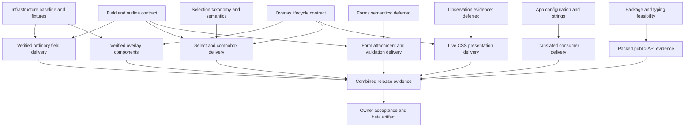

# Buntpapier beta

Bring the form controls and overlays to `3.0.0-beta.1`, with shared API contracts and evidence for the accessibility target. Beta owns milestone scope, boundaries between subjects, dependencies and combined release acceptance. Subject quests own their detailed contracts; delivery briefs preserve component requirements until a bounded outcome is selected.

## Authority and current state

On 2026-09-18 the owner deferred style observation and validation/forms, then requested focused subquests. On 2026-09-19 the owner requested the [readiness review](research/2026-09-19-readiness-review.md), directed that infrastructure have its own quest without implementation by the reviewing agent, and accepted the review recommendations: “we can integrate the datepicker-plan.md, then delete it. the todos in the readme can just go. agree on your other points, go”. This authorizes the documentation consolidation and the ownership, sequencing and working format below. It does not resume the deferred subjects or start infrastructure implementation.

On 2026-09-20 the owner selected [infrastructure design and planning](../infrastructure/spec.md), chose a minimal first delivery and confirmed that beta keeps reactivity-transform. The owner subsequently approved the delivery proposal with existing behavior tests migrated to owned fixtures and docs smoke clearly separated, and approved test-policy. Infrastructure records the amended M1 and the [accepted testing policy](../../design/testing.md); implementation remains unstarted with no executor assigned. No product subquest is selected. [API decisions](../../design/api-design.md) are adopted; acceptance of the completed API work record remains separate from those decisions. Picker baseline repairs and earlier two-engine checks are reported in [their work record](work/date-pickers.md). Infrastructure subsequently verified the owner-supplied green three-engine CI baseline at `e1e0d4b`; this is historical evidence, not beta acceptance. [Documentation work](work/documentation.md) records the consolidation and its checks.

## Shared constraints and durable outputs

- [API guide](../../design/api-guide.md) and [API decisions](../../design/api-design.md): ordinary components by default, selective primed workflows, live CSS presentation and common field vocabulary.
- [Architecture](../../design/architecture.md): native platform direction, browser floor, internal behavior boundaries and dependency rationale. Verify required subfeatures at the supported floor before retiring a bridge.
- [Accessibility acceptance](../../design/accessibility.md): component criteria and required automatic/manual evidence.
- [Bridge inventory](../../design/js-bridge-inventory.md): JavaScript responsibilities and retirement conditions. Observer replacement and public-token registration remain unresolved; `useComputedStyle` retains its call signature.
- [Picker interaction](../../design/date-picker-interaction.md): current interaction and retained design rationale. Remaining editing work belongs to its delivery brief.

Narrative public docs remain human-authored; agent work in `docs/` is limited to mechanical references and permitted evidence records. RTL delivery is outside beta scope; new styles use logical properties and avoid blocking later support. The accepted removal of Vuelidate is direct, without an adapter or compatibility period, when its replacement lands.

## Subquests

| Owner | Outcome | Boundary and dependency |
|---|---|---|
| [Infrastructure and verification](../infrastructure/spec.md) | CI baseline, reusable fixtures, ephemeral testing and retention policy, shared accessibility styles and announcement behavior | Implementation belongs to a separate executor; packaging supplies its public type/consumer contract; components supply expected behavior |
| [Overlay lifecycle](../overlay-lifecycle/spec.md) | Native transitions, focus, dismissal and overlay migration | Native transition design can proceed independently; shipping live CSS behavior requires actual observation evidence |
| [Field wiring](../field-wiring/spec.md) | DOM naming, attributes, readonly, outline and the control attachment interface | Ordinary fields can proceed; the adapter consumes forms' logical state and participation semantics |
| [Selection and naming](../selection/spec.md) | Taxonomy, identity, active/selected items and select/combobox delivery | Settle taxonomy before public signatures; consume overlay entry/exit and field attachment |
| [Initialization and strings](../app-configuration/spec.md) | Reactive locale/dictionaries, local overrides, app isolation and SSR consistency | Infrastructure owns announcement mechanics; validation keys follow forms' error model |
| [Packaging and declarations](../packaging/spec.md) | Exports, Vue compatibility, declarations, SSR imports and packed consumers | Begin feasibility early; extend evidence when public APIs settle; infrastructure runs the checks |
| [Primed-view attachment](../primed-components/spec.md) | Stable view identity, mounts, forwarding, lifetime and cancellation | An actual in-scope workflow is required before its factory API; every published primed surface must pass this contract |
| [Style observer](../style-observer/spec.md) | Observation/registration choice and browser integration evidence | Deferred; affects live presentation delivery, not unrelated contract design |
| [Validation and forms](../validation-forms/spec.md) | Logical field state, validation/schema behavior and form authoring | Deferred; its semantics precede finalizing form integration, not ordinary field naming or overlay design |

## Milestone scope and delivery ownership

The inventory commits to outcomes; unresolved component names, signatures and presentation policies stay with their owners. All entries inherit the shared acceptance criteria. Missing verification cannot be turned into a follow-up without an explicit scope decision.

| Outcome | Delivery owner | Scope still to settle locally |
|---|---|---|
| Button, input, checkbox, circular progress, ripple and scrollbars | [Existing controls brief](work/components.md) | Component-specific accessibility fixes and bridge retirement where justified |
| Field wrapper and custom/group control attachment | [Field wiring](../field-wiring/spec.md) | Wrapper API and control adapter after required forms semantics |
| Form workflow and validation replacement | [Validation/forms](../validation-forms/spec.md) | Returned form view versus separate `bunt-form`, schema/definition and template API |
| Single-date and date-range pickers | [Date-input delivery](work/date-inputs.md) | Locale editing, range drafts and responsive presentation, coordinated with shared contracts |
| Select and editable/free-text selection | [Selection](../selection/spec.md#delivery-brief) | Select/combobox names and interaction split; multi-select remains a beta scope question |
| Tooltip with directive sugar, dialog and popover | [Overlays](../overlay-lifecycle/spec.md#delivery-brief) | Native positioning/migration and component-specific lifecycle policies |
| Textarea, number input, radio/group, checkbox group, switch and slider | [New control briefs](work/components.md) | Textarea surface, number parsing/AT model and slider thumb count |
| Menu/items and toast workflow | [Remaining overlay briefs](work/components.md) | Menu interaction and toast timing/actions using the shared overlay and announcer contracts |
| English built-in strings and a complete German dictionary | [Initialization](../app-configuration/spec.md) | Formatting/translation precedence and validation keys |
| Published JS, CSS and useful declarations | [Packaging](../packaging/spec.md) | Consumer imports, compatibility and SSR contract |
| Integrated examples, documentation and beta artifact | [Release evidence](work/release.md) | Named human authors/testers and final scope reconciliation |

Recipes cover search with clearing, password reveal in input, button groups, split buttons, cards, skip links, empty states, description lists and icon usage. These do not create extra component commitments. Navigation, data display, additional pickers and other future candidates live in [TODOs](../../TODOs.md#later-phase-candidates). Charts, rich text, carousels, virtualized data grids, schedulers, maps, drag-and-drop frameworks, speed dials and mega menus are outside this milestone.

## Dependencies and order of work

A prerequisite for shipping an outcome does not automatically block its design. Select and verify bounded outcomes rather than waiting for every contract to finish.

These are outcome dependencies, not a requirement to complete unrelated branches before starting a design. Before implementing a selected outcome, record its starting evidence and applicable checks. Component delivery consumes only the shared foundations and package/type checks it needs; infrastructure setup is not gated on its own completion. A full green CI baseline remains release evidence. Native overlay probes may inject resolved policy values while observation is deferred, but their result cannot stand in for stylesheet-driven update evidence.

1. Use the verified CI baseline and assign the approved minimal infrastructure delivery, including fixture migration and separate docs smoke; begin packaging feasibility independently. Keep reactivity-transform and verify that dependent type tooling supports it.
2. Design independent app configuration, ordinary field/outline, overlay and selection contracts. Overlay lifecycle is the recommended first product discussion because its open-calendar transition case serves several consumers.
3. Prove one representative control through its required contracts, typing, CSS behavior and early manual AT checks. Use that evidence before expanding the component families.
4. Resume deferred observation or forms when their consumers require them. Do not ship live presentation or form integration with those criteria unresolved.
5. Deliver the remaining families, verify their combined behavior, and close the [release evidence](work/release.md). Packaging gains consumer cases throughout delivery.

The earlier requirement to ship declarations in the next alpha remains a packaging deliverable; it is not an exit condition for unrelated design work. No alpha or beta publication is authorized by this plan.

## Parent decisions and open questions

On 2026-09-20 the owner decided “for beta: reactivity-transform: keep, definitely” in the infrastructure design request. Keep `$ref`/`$computed` and the existing transform for beta; new composables and package/source/Pug tooling must support them. No migration is planned. This closes the policy gate, while packaging still owns proving its type-check approach.

| Shortname | Type | Question / current direction | Gate |
|---|---|---|---|
| multiselect-scope | decide | Include multi-select in beta? Recommendation remains later; no scope decision yet. | After selection taxonomy, before final component scope |
| primed-workflow | decide | Which beta workflow proves attachment and typing? Form workflow is a candidate; loader/editor are not extra beta products. | Before publishing a primed API; explicitly narrow scope if beta will ship none |
| native-select | research, decide | Add an optional customizable native select or wait for the supported browser target? | Revisit when support at that target is verified |
| picker-scope | decide | Which remaining locale/range/mobile editing outcomes must ship in beta? | [Date-input delivery](work/date-inputs.md) prepares the cases before final scope |
| manual-at-and-docs | unblock | Name manual testers, machines and human narrative authors. | [Release record](work/release.md#people-and-external-evidence) tracks assignments and missing evidence |

Forms authoring, outline treatment, overlay tokens, number input and textarea details are local decisions in the linked scopes. Adoption of the API direction is distinct from acceptance of a completed work item, and neither supplies missing implementation or release evidence.

## Working format

Start each topic with a concrete consumer scenario and the next decision it exposes. Separate accepted constraints from source observations and proposals. Compare credible options, recommend one with its strongest drawback, and name what the choice unblocks. When evidence is missing, define the smallest probe and its stopping point.

Keep the chosen contract and alternatives in one owning spec. Add tasks only for the selected bounded outcome, then implement and verify its criteria and shared scenarios. Obtain outcome acceptance and promote reusable contracts to `design/`. Routine settled work can use a short brief; a component or composable does not automatically need a new quest.

Beta keeps scope, shared constraints and dependencies. Subject quests hold local decisions and continuation state; their work records hold selected bounded delivery; research/prototypes hold dated evidence; `design/` holds lasting accepted guidance; `docs/` holds public material under its authorship rules. `TODOs.md` is the backlog outside quest scope.

## Release acceptance

[The release record](work/release.md) is the single component/evidence matrix. It tracks automated and manual checks, mechanical references and human narrative docs, packed consumers, migration notes and integrated scenarios. Record source revisions and browser/AT versions; evidence becomes stale when relevant behavior changes.

Beta requires the agreed inventory to satisfy accessibility acceptance, the settings/async-save and searchable-list/edit-dialog examples to pass their keyboard and AT scenarios, and the actual release artifact to pass package checks. Resolve pending scope choices and unavailable manual evidence before claiming completion. The owner accepts the combined result; tagging and publication remain separately authorized release actions.
