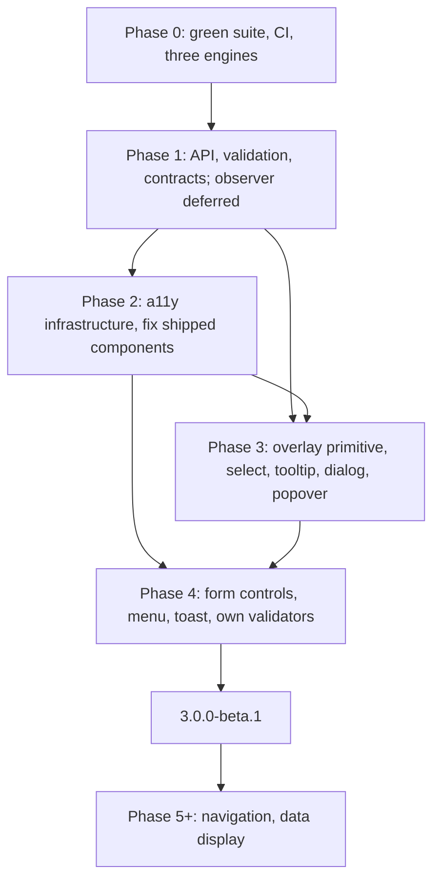

# Buntpapier beta

Bring the form controls and overlays to `3.0.0-beta.1`, with shared API contracts and evidence for the accessibility target. It owns milestone scope, shared constraints, sequencing and release acceptance. Focused quests own their unresolved designs; creating their records does not select them for execution.

## Authority and current state

The owner deferred the observer and forms discussions on 2026-09-18. The owner subsequently requested “continue beta, discuss next steps”, then “feels like this calls for more subquests to define” in the same conversation. The current scope is to define focused subquests, preserve their inherited requirements and dependencies, and present the resulting work map. Product investigation and implementation still require selection of their scope.

No product subquest is selected. The observer and forms discussions remain deferred. Contract work is planned. The API design record is complete as recorded in its work spec; date-picker follow-up implementation and Chromium/Firefox checks are reported complete, with WebKit and manual checks outstanding. Neither report establishes beta acceptance.

The [research index](research/README.md) holds dated audits and proposal evidence. [Documentation verification](work/documentation.md) records checks of the internal documentation organization.

## Subquests

Beta owns milestone scope, shared constraints, boundaries between subquests, sequencing and combined release acceptance. Each sibling subquest owns its questions, local design and evidence. These briefs define the next design scopes; detailed signatures, probes and implementation tasks belong to the selected scope.

| Subquest | Outcome | Dependencies and boundary |
|---|---|---|
| [Overlay lifecycle](../overlay-lifecycle/spec.md) | Open-state, native-event, focus and dismissal contract across live presentation changes | Transition design can proceed independently; integrated live CSS evidence consumes the deferred observer result |
| [Field wiring](../field-wiring/spec.md) | Naming, attributes, readonly interaction, feedback attachment, form connection and outline decision | Ordinary field and outline work can proceed; validation wiring consumes forms policy; coordinate focus with overlays |
| [Selection and naming](../selection/spec.md) | Select/combobox taxonomy, value identity, active item and keyboard semantics | Settle names before public signatures; coordinate focus with overlays; beta retains multi-select scope |
| [Initialization and strings](../app-configuration/spec.md) | Reactive app defaults, local overrides, dictionaries, isolation and SSR consistency | General configuration can proceed; validation message keys follow forms; packaging owns entry points |
| [Primed-view attachment](../primed-components/spec.md) | A selected workflow proves attachment, mount limits, forwarding, lifetime and cancellation | Choose an actual workflow first; use overlay semantics where applicable and packaging for declaration evidence |
| [Packaging and declarations](../packaging/spec.md) | Export, declaration and SSR-import contract verified through consumer cases | Core package design can proceed; integrate selected primed API and app-configuration evidence as available |

The existing [style-observer](../style-observer/spec.md) and [validation/forms](../validation-forms/spec.md) quests remain deferred. The outline experiment stays within field wiring; Phase 0 verification stays in [its work record](work/date-pickers.md). Later component delivery remains in the phase briefs until selecting it warrants further decomposition.

Recommended first discussion: overlay lifecycle, because it serves several planned components and the existing pickers. Initialization and strings is the more self-contained alternative. Selection owns taxonomy before the select rewrite; packaging can establish its core contract independently. These are sequencing recommendations, not active assignments. Browser CI evidence remains a baseline check before implementation, and deferred dependencies remain required for their affected outcomes.

Definition check, 2026-09-18: the five contract areas retain their requirements in separate records, packaging has its own design brief, and each record has a beta parent, named questions, dependencies and completion evidence. Static checks passed for 215 local links and heading targets, all five transferred requirement sections, planned/deferred states and preservation of the staged index and unrelated files. Whitespace checks passed; prose-lint flags were reviewed. Project routing links were checked statically; fresh-client behavior was not tested. No subquest investigation, prototype or product implementation was started.

Source check at `e1e0d4b09f59ac4baf3850f29425c2fe4c7ae82b`, with the existing dirty documentation tree preserved: [select](../../src/components/select.vue) uses Floating UI, [tooltip](../../src/directives/tooltip.ts) uses Popper, and the pickers already use native popovers. [The package](../../package.json) has no declaration build or `types` entry; [the entry point](../../src/index.ts) registers components without app configuration. [CI](../../.github/workflows/ci.yml) defines all three Playwright engines, but no CI result was retrieved and no tests were rerun for this discussion. The API and documentation work records retain their pending owner acceptance.

## Shared constraints and durable outputs

- [API guide](../../design/api-guide.md) and [API decisions](../../design/api-design.md): ordinary and primed components, live CSS presentation, field vocabulary and accepted validation direction.
- [Architecture direction](../../design/architecture.md): browser target, native overlays, internal behavior primitives and dependency rationale.
- [Accessibility acceptance](../../design/accessibility.md): component acceptance criteria and required evidence.
- [JavaScript bridge inventory](../../design/js-bridge-inventory.md): current responsibilities and retirement conditions.
- [Date-picker interaction record](../../design/date-picker-interaction.md): research and interaction decisions, with a current-behavior correction.

Public narrative documentation remains human-authored; agent documentation work in `docs/` is limited to mechanical references. Existing roadmap requests for narrative guides and integrated examples need their human author assigned before release.

## Work ownership and dependencies

| Scope | Owning record | State and dependency |
|---|---|---|
| Ground truth and date-picker follow-up, Phase 0 | [Date-picker work](work/date-pickers.md) and Phase 0 below | Implementation and two-engine evidence reported; verify the full CI matrix before calling Phase 0 complete |
| Style observation, Phase 1.1 | [Observer quest](../style-observer/spec.md) | Deferred; WebKit, integration prototype and registration decision remain open |
| Bridge inventory, Phase 1.2 | [Inventory](../../design/js-bridge-inventory.md) | Audit complete; retirement work belongs to the delivery phases below |
| API authoring, Phase 1.3 | [API work](work/api-design.md) | Design complete as reported; durable decisions live in `design/` |
| Validation/forms, Phase 1.4 | [Forms quest](../validation-forms/spec.md) | Deferred; schema, behavior and control connection precede form integration |
| Component contracts, Phase 1.5 | [Subquest map](#subquests) | Five planned scopes own field, overlay, selection, app-configuration and primed-view contracts |
| Naming and packaging, Phase 1.6–1.7 | [Selection](../selection/spec.md) and [packaging](../packaging/spec.md) | Planned; decide select taxonomy and export/SSR contract before dependent implementation |
| Infrastructure, overlays and missing controls | Phases 2–4 below | Planned briefs; refine local acceptance when selected, using the shared accessibility criteria |
| Post-beta candidates and unrelated follow-ups | [TODOs](../../TODOs.md) | One backlog; later catalog entries remain candidates, not commitments |

## Delivery plan

The following scope remains proposed where a focused quest has not settled it. Later decisions take precedence: forms behavior is open; select/combobox taxonomy is undecided; checkbox graphics retain their separate contrast requirement; date-picker keyboard and inline fixes already landed according to the newer work record. Estimates are planning inputs, not measured costs or implementation authorization.

## 2. Roadmap

Phases are ordered by dependency. No calendar dates; each phase has an exit criterion.

### Phase 0: ground truth

The date-picker follow-up is recorded in [its work spec](work/date-pickers.md). Source inspection on 2026-09-18 confirms that the three-engine [Playwright configuration](../../playwright.config.ts) and [CI workflow](../../.github/workflows/ci.yml) exist and `color-blend` is a runtime dependency. The unused picker copy and Stylus file are absent. These source checks do not establish a green CI run.

Scope: repair picker assertions against intended behavior; configure Chromium, Firefox and WebKit; run lint, library/docs builds and all suites in CI; remove the unused picker copy and Stylus file; fix runtime dependency placement and the Firefox README floor; reconcile stale TODO entries. Verify remaining evidence against the current checkout before closing this phase.

Exit: all five suites green on three engines in CI. The full CI result remains unverified here.

### Phase 1: API design and primitives

The design phase. Output is documents, spikes and ADRs, plus a working prototype of the new style observer core once item 1 resumes. No component ships from this phase.

1. **Style observer core.** **Deferred 2026-09-18.** The spike ran on Chromium 147 and Firefox 148; findings, the option matrix and what would settle it are in [observer quest](../style-observer/spec.md). WebKit and a prototype behind `useComputedStyle` are still missing. Scope: evaluate `style-observer` (observe.style) as the replacement for `computedStyle.ts`, `themeWatcher.ts` and `requestAnimationFrameMuxxer.ts`. `useComputedStyle` keeps its call signature whatever the outcome.
2. **JS bridge inventory.** **Completed 2026-09-18.** [The inventory](../../design/js-bridge-inventory.md) records source locations, native replacements, support status and retirement conditions, including scrollbars, ripple geometry, checkbox icon lookup and overlay theme forwarding. Implementation stays in the assigned later phases; the outline prototype belongs to the field contract work.
3. **API philosophy update.** **Design record completed 2026-09-18.** [Decisions, alternatives and shared field vocabulary](../../design/api-design.md) cover ordinary and primed components, shared workflow state/lifetime, live CSS presentation, clear controls, icons and calendar settings. The [evergreen internal API guide](../../design/api-guide.md) explains the authoring model. Per the owner's direction, narrative public docs stay human-written; this guide lives in `design/` and is linked from `AGENTS.md`. Implementation mechanics remain in Phase 1.5.
4. **Validation model.** **Deferred by the owner, 2026-09-18.** Own form/validation orchestration, `useForm` direction and direct Vuelidate removal are settled. [Validation/forms](../validation-forms/spec.md) preserves template alternatives, behavior proposals and resume questions. Consider Valibot/Zod-style schemas and inferred types before fixing the definition API; no schema dependency is selected. Independent contract work can proceed according to the recorded dependency assessment.
5. **Contracts.** Write the four internal contracts before any composite lands: [field wiring](../field-wiring/spec.md), [overlay lifecycle](../overlay-lifecycle/spec.md), [selection](../selection/spec.md) and [initialization/strings](../app-configuration/spec.md). [Primed-view attachment](../primed-components/spec.md) owns workflow-specific mounts, forwarding and cancellation. Each completed contract needs its internal signature, emitted semantics and verification evidence. Section 9 lists the candidate composables. Form integration within field wiring depends on Phase 1.4's behavior decisions.
6. **Select and Combobox naming.** The [selection quest](../selection/spec.md) owns taxonomy before its public signatures and the select rewrite.
7. **Packaging.** The [packaging quest](../packaging/spec.md) owns a declaration build and `types` entry, individual component exports and SSR-safe module init (`requestAnimationFrameMuxxer.ts` and `themeWatcher.ts` already guard on `import.meta.env.SSR`; the new core must too).

Exit: ADRs for items 3, 4 and 6 accepted, item 1 deferred (see [observer quest](../style-observer/spec.md)); the four contracts written; a `types` entry ships in the next alpha. The prototype criterion for the observer core (passes the dark-mode and light-dark token suites on three engines) moves with item 1.

### Phase 2: infrastructure and shipped-component fixes

Deliverables: section 7.2 items 1 to 12, section 7.3 fixes 3 to 9, the test fixtures from section 11, the accessibility guide page and the per-component Accessibility section template. The style observer core swap waits for the deferred Phase 1 item 1.

Exit: button, checkbox, input, progress and both date pickers pass the definition of done. Calendar grid reachable from the keyboard. axe and aria snapshots run in CI. Own validation model in place, Vuelidate support and the legacy `validation` prop removed, public validation docs reflect the replacement.

### Phase 3: overlay primitive

Deliverables: `useOverlay`, `useDialog`, `useDismiss`; `bunt-tooltip` with `v-tooltip` kept as sugar; `bunt-dialog`; `bunt-popover`; `bunt-select` rewritten on the primitive with full combobox semantics. Remove `@floating-ui/vue`, `@popperjs/core` and the `#bunt-teleport-target` requirement. Migration note in the docs.

Exit: no third-party positioning code in the bundle. Select, tooltip, dialog and popover pass the definition of done including one manual screen reader pass each.

### Phase 4: form controls and remaining overlays

Deliverables: `bunt-field`, `bunt-textarea`, `bunt-number-input`, `bunt-radio` and `-group`, `bunt-checkbox-group`, `bunt-switch`, `bunt-slider`, `bunt-combobox`, `bunt-menu`, `bunt-toast`. Own validators complete, `validation` prop removed. German strings dictionary complete. Two integrated examples in the docs: a settings form with validation and async save, and a searchable record list with an edit dialog and confirmation.

Exit: every component in section 8.1 passes the definition of done. Both examples work with keyboard, NVDA and VoiceOver. Tag `3.0.0-beta.1`.

### Phase 5 and later

Navigation and layout first (tabs, disclosure and accordion, breadcrumbs, pagination, toolbar), then data display (table, chips, badge, skeleton, linear progress, empty state), then more pickers. [The later-phase candidates](../../TODOs.md#later-phase-candidates) preserve the recipe-versus-component options. Planned separately once Phase 4 is out.

### Dependency outline

## 3. Kill list

Things that leave the codebase during this plan, with the phase that removes them.

| what | why | phase |
|---|---|---|
| `date-picker copy.vue`, `typography.styl` | absent at the 2026-09-18 check | 0, removal present |
| obsolete picker selectors and fixmes | follow-up records role-based fixtures and passing Chromium/Firefox checks | 0, full CI evidence pending |
| `@popperjs/core` | tooltip positioning; replaced by anchor positioning | 3 |
| `@floating-ui/vue` | select positioning; replaced by anchor positioning | 3 |
| `#bunt-teleport-target` and `dropdownThemeStyle` | in-tree popover inherits the theme context | 3 |
| the mirrored input strip inside the select dropdown | in-tree dropdown does not need to redraw the field | 3 |
| Vuelidate-shaped `validation` prop (`$error`, `$errors`, `$touch`) in input and select | replaced by own validation model without a migration phase | 2 |
| `docs/validation.md` as written | imports a path that does not exist | 2 |
| `requestAnimationFrameMuxxer.ts` and the `--bunt-will-change` polling opt-in | retirement depends on the chosen observer; transition observation remains a candidate | deferred with Phase 1 item 1 |
| `themeWatcher.ts` and the exported `refreshComputedStyles()` | replacement or retention depends on the observer decision | deferred with Phase 1 item 1 |
| hardcoded English strings in date pickers and select | strings dictionary | 2 |
| `--clr-*-text-light` / `-dark` deprecated tokens | already replaced by derived tokens | beta.1 |

Not on the list: `color` (still needed for the contrast guard, no platform parser yet), `@js-temporal/polyfill` (Safari has no Temporal), `@vue-macros/reactivity-transform` (see `reactivity-transform` in the open questions).

## 5. API design and the style observer core

The [observer quest](../style-observer/spec.md), [API decisions](../../design/api-design.md), [bridge inventory](../../design/js-bridge-inventory.md) and [contract subquests](#subquests) own this work.

## 6. Validation: kill vuelidate, own the model

The [forms quest](../validation-forms/spec.md) owns the deferred behavior and authoring questions. The [accepted direction](../../design/api-design.md#validation-direction) preserves own orchestration, `useForm` and direct removal of Vuelidate.

## 7. Accessibility plan

### 7.1 Definition of done per component

Use the [durable acceptance criteria](../../design/accessibility.md).

### 7.2 Cross-cutting infrastructure (Phase 2)

1. **Focus ring tokens.** `--focus-ring-color` (default `var(--clr-primary)`, guarded to 3:1 against the surface by the contrast bridge), `--focus-ring-width` (2px), `--focus-ring-offset` (2px). Implemented as `outline`, which survives forced colours and needs no layout room. Applied via `:focus-visible` on native focusables and roving-tabindex items. Checked against 2.4.11: not obscured by sticky content or overlays.
2. **Motion tokens.** `--motion-duration-short/medium`, `--motion-easing`. One `@media (prefers-reduced-motion: reduce)` block in the derived layer sets durations to 0ms. Ripple checks the same query in JS. No component hardcodes a duration.
3. **Forced colours.** One `@media (forced-colors: active)` block per component: border or outline on anything whose state is background-only today (filled buttons, checked box, selected option, switch track, slider thumb). System colours (`ButtonText`, `Highlight`, `SelectedItem`, `GrayText`, `Canvas`). The contrast bridge returns early when the media query matches. Test real Windows contrast themes once per release, not only emulation.
4. **Live region.** `useAnnouncer()` plus one host element appended on plugin install: light DOM, one `role=status` and one `role=alert` child, messages written after a short delay for Safari and cleared after 7 s. Consumers: button loading and outcome, select result count and selection, toast, date picker range steps.
5. **Strings.** `app.use(Buntpapier, { strings })` with an English default and a German dictionary shipped. `useStrings()` via provide/inject; every component accepts a `strings` prop for partial override. Initial keys: `close`, `clear`, `open`, `loading`, `success`, `error`, `nothingFound`, `resultsAvailable(n)`, `selected`, `previousMonth`, `nextMonth`, `openCalendar`, `chooseDate`, `chooseDateRange`, `week`, `weekNumber(n)`, `required`, `optional`, `increment`, `decrement`, `showPassword`, `hidePassword`, `dismiss`, plus validity keys to be decided by the forms contract. Functions for plurals. RTL is out of scope for this milestone; new Sass uses logical properties so it stays possible.
6. **Ids.** `useId()` everywhere. Fixes `dp-month-label` and the month-keyed calendar label.
7. **`.bunt-sr-only`** in the reset layer; the `date-picker.sass` copy goes.
8. **Target size.** Compact controls keep a 24px hit area via a `::before` hit box where the visual box is smaller (small checkbox, icon-only small buttons, day cells). Documented exceptions: inline links, dense tables when the app opts in.
9. **Form-field wiring.** `useFormField()`: label, hint and error ids, error associations chosen through the [forms accessibility comparison](../validation-forms/spec.md#accessibility), `aria-invalid`, `aria-required`. Works inside the existing `bunt-input` shell and in the new `bunt-field` wrapper. Hint element stays rendered in compact size so the id is stable and errors remain visible; compact drops the reserved height, not the element.
10. **Attribute passthrough.** `inheritAttrs: false` in every form component; `class` and `style` on the root, everything else (`name`, `autocomplete`, `inputmode`, `required`, `aria-*`, `data-*`) on the inner control. Documented escape hatch for ambiguous attributes.
11. **Decorative icons.** Every `.mdi` `<i>` gets `aria-hidden="true"`. A `bunt-icon` with optional `label` comes later.
12. **Overlay tokens.** `--popover-placement`, `--popover-offset` defined now so tooltip and select adopt them in Phase 3 without another API change.

### 7.3 Fixes to shipped components

Ordered by user impact.

1. `bunt-select` (Phase 3): rebuilt on the overlay primitive. Input gets `role=combobox`, `aria-expanded`, `aria-controls`, `aria-autocomplete=list`, `aria-activedescendant`; stable name while open. List becomes `ul role=listbox` with `li role=option aria-selected id`, groups as `role=group aria-labelledby`. Keys: Down, Up, Alt+Down, Home, End, PageUp, PageDown, Enter, Escape, typeahead when not filtering. Result count and selection announced. `readonly` and `disabled` enforced, not just forwarded. Multi-select is a follow-up.
2. `v-tooltip` becomes `bunt-tooltip` (Phase 3) with the directive kept as sugar: `role=tooltip`, `aria-describedby` on the trigger while open, shows on `focus-visible` and after a hover delay with warm-up, stays while the pointer is over it, hides on blur, pointer leave or Escape, never opens on touch. `popover=manual` plus anchor positioning. No interactive content. Icon-only buttons with a tooltip and no name derive `aria-label` from the tooltip text.
3. `bunt-button`: `label` prop for icon-only buttons, dev warning when neither text nor label exists. `aria-busy` while loading, announcements through `useAnnouncer`. Router-link variant drops `href` when disabled. Ink guard to 4.5:1.
4. `bunt-input`: field wiring, passthrough, `:user-invalid`, validation model from section 6, `type=password` reveal toggle using the dictionary.
5. `bunt-checkbox`: focus ring on the box via `:has(input:focus-visible)`, `indeterminate` prop mapped to `input.indeterminate`, drop `readonly`, field wiring, forced-colours border, contrast appropriate to text versus checkbox graphics per the bridge inventory, `--checkbox-weight: subtle` for dense tables.
6. Date pickers: retain the implemented Alt+Down/grid Tab route, inline rendering, clear actions, gridcell selection and unique labels described in [the interaction record](../../design/date-picker-interaction.md). Remaining work includes shared strings, target-size and AT checks, locale-aware segment/display design and the other follow-ups in [the picker work record](work/date-pickers.md). The earlier bare-Down proposal is superseded: bare arrows edit input segments.
7. `bunt-progress-circular`: `role=progressbar`, optional `value` with `aria-valuenow/min/max`, `label`; indeterminate spinner slows to a fade under reduced motion.
8. `v-ripple-ink`: no-op under reduced motion.
9. `bunt-scrollbars`: verify keyboard scrolling of the container; replacement by `scrollbar-width: thin` plus `scrollbar-color` is a later spike.

## 8. Component inventory

### 8.1 This milestone: form controls and overlays

| component | base | APG pattern | notes |
|---|---|---|---|
| `bunt-field` (new) | `
` with label, hint, error; `fieldset`/`legend` mode | none, wiring only | hosts `useFormField`; used by radio group, checkbox group, custom controls |
| `bunt-form` (new) | native `<form novalidate>` | none | hosts `useForm`, emits `submit` when valid, error summary recipe |
| `bunt-input` (rework) | native `<input>` | none | field wiring, passthrough, password reveal, validation model |
| `bunt-textarea` (new) | native `<textarea>`, `field-sizing: content` | none | `--textarea-rows-min/max` in `lh`, optional counter announced politely |
| `bunt-number-input` (new) | text input, `inputmode=decimal`, optional stepper | see `number-input` | React Aria and Reka both went `type=text`; no `spinbutton` role on the input for iOS VoiceOver |
| `bunt-checkbox` (rework) + `bunt-checkbox-group` (new) | native checkbox; group as fieldset | Checkbox | indeterminate, subtle weight |
| `bunt-radio` + `bunt-radio-group` (new) | native `<input type=radio>` in a fieldset | Radio Group, native arrow keys | same visual system as checkbox |
| `bunt-switch` (new) | `<input type=checkbox role=switch>` | Switch | Space toggles |
| `bunt-slider` (new) | one native `<input type=range>` per thumb, custom track | Slider, Multi-Thumb | native keys and click-on-track give the 2.5.7 alternative for free |
| `bunt-select` (rewrite) | text input plus listbox popover | Combobox with listbox popup | see `select-taxonomy` for naming |
| `bunt-combobox` (new) | same implementation, free text allowed | Combobox, `aria-autocomplete=both` | shares `useListbox` |
| overlay primitive (internal) | `popover` element, anchor positioning | none | `useOverlay`, section 9 |
| `bunt-tooltip` (new) + `v-tooltip` | `popover=manual` | Tooltip | replaces popper |
| `bunt-dialog` (new) | `<dialog>` + `showModal()` | Dialog (Modal), Alert Dialog via `role=alertdialog` | title slot as `aria-labelledby`, no explicit `aria-modal` (Safari misbehaves), `--dialog-size`, `--dialog-placement` (center, later side for drawers), CSS scroll lock via `html:has(dialog:modal)`, `@starting-style` animation |
| `bunt-popover` (new) | `popover=auto`, `role=dialog` | Dialog (non-modal) | rich content anchored to a trigger, focus moves in when opened by keyboard |
| `bunt-menu` + `bunt-menu-item` (new) | `popover=auto`, `role=menu` | Menu Button, Menu | `menuitem`, `menuitemcheckbox`, `menuitemradio`, separators, roving tabindex, typeahead. Submenus later. |
| `bunt-toast` + `useToast()` (new) | `popover=manual` stack, `role=region` landmark named from the dictionary, `role=status` per toast, `role=alert` for errors | Alert | region exists before the first toast, documented hotkey into the region, pause on hover and focus, 5 s minimum, no auto-dismiss with an action, corner placement that does not cover focus |

### 8.2 Recipes, not components

Documented compositions with native HTML first. Promoted to a component only when repeated use shows an API worth owning: search input with clear action, password input (folded into `bunt-input`), button group, split button, card, skip link, empty state, description list, icon usage.

### 8.3 Not planned

Charts, rich text editor, carousel, virtualised data grid, scheduler, maps, drag-and-drop framework, speed dial, mega menu. Apps that need them pull a dedicated library; we supply styling recipes where it makes sense.

## 9. Behaviour layer, and why no headless core

The [architecture direction](../../design/architecture.md#behavior-layer) owns the dependency decision and rationale. Candidate composable signatures and line counts below remain estimates for later contracts.

### Composables

All under `src/composables/`, internal for now. Estimates are rough.

| composable | does | used by | size |
|---|---|---|---|
| `useComputedStyle` (rewrite) | the existing signature on top of the new observer core; synchronous first read, event-driven updates | every component | ~120 |
| `useOverlay` | sets `popover`, opens with the native Popover API; verify source-based focus ordering against the picker Firefox finding, writes `anchor-name`/`position-anchor`, maps `--popover-placement` to `position-area` and `position-try-fallbacks`, syncs `open` from `toggle`, moves focus in on keyboard open, returns focus on close | tooltip, select, combobox, menu, popover, toast | ~150 |
| `useDialog` | wraps `<dialog>`: `showModal`, `requestClose`, backdrop click, `cancel`/`close` to `v-model:open`, initial focus | dialog, alert dialog, later drawer | ~80 |
| `useDismiss` | what the platform does not cover: focus leaving a combobox, pointerdown outside a `manual` popover, Escape for manual popovers with topmost-layer ordering | select, combobox, tooltip, toast | ~100 |
| `useRovingTabindex` | one tab stop, arrows with orientation and wrap, Home/End, remembers last focused | menu, toolbar, tabs, calendar grid | ~100 |
| `useListbox` | selection model, active index, `aria-activedescendant`, disabled skipping, groups, typeahead timer, scroll-into-view | select, combobox, later listbox and multi-select | ~250 |
| `useAnnouncer` | `announce(text, 'polite' \| 'assertive')` against the shared live region | button, select, toast, date pickers | ~60 |
| `useFormField` | ids, `aria-describedby`, `aria-invalid`, `aria-required`, provide/inject, validity mapping | all form controls, `bunt-field` | ~120 |
| `useForm` | field registry, `validate`, `reset`, `focusFirstInvalid` | `bunt-form` | ~80 |
| `useStrings` | dictionary lookup with per-component override | everything with built-in text | ~40 |
| `useFocusTrap` | only for a non-modal popover that must contain focus; wraps `focus-trap` if such a case appears | nothing yet | 0 until needed |

The risky part is `useListbox`: `aria-activedescendant` versus roving focus, typeahead timing and disabled-item skipping are where libraries accumulate bug reports. Vitest coverage goes there first.

## 11. Testing and documentation

Testing additions:

- `@axe-core/playwright` fixture via `test.extend` with the five WCAG tags. axe's WCAG 2.2 coverage is a single rule, `target-size`, and it is off unless `wcag22aa` is in the list. Known-issue fingerprints are snapshotted rather than rules disabled.
- `toMatchAriaSnapshot()` per component and state (closed, open, selected, invalid, disabled) as `.aria.yml`. This is the regression net for roles, names and states.
- Keyboard tests: one per keyboard table row, driven with `page.keyboard`.
- `page.emulateMedia({ forcedColors: 'active' })` and `reducedMotion: 'reduce'` screenshots for components with forced-colours blocks.
- Vitest for the composables and validators. No DOM layout needed there.
- Three engines in CI from Phase 0.
- `eslint-plugin-vuejs-accessibility`: the repo already lints pug templates through `eslint-plugin-vue-pug`, so this is likely to work. Spike in Phase 2.
- Manual pass per component with a checklist in `docs/guide/accessibility.md`: NVDA + Firefox, VoiceOver + Safari (macOS and iOS), 200% and 400% zoom, Windows High Contrast. Results recorded on the component page. Guidepup in CI is a later spike.

Documentation:

- New `docs/guide/accessibility.md`: what the library guarantees, the focus, motion and forced-colours tokens, configuring strings, what the app still has to do.
- Public API narrative stays human-written. Evergreen internal guidance lives in `design/api-guide.md`, with Phase 1 decisions and alternatives in `design/api-design.md`; agent edits to public docs are limited to mechanical documentation such as component API references.
- `docs/validation.md` rewritten around section 6.
- Every component page gets an Accessibility section in the PrimeVue shape: pattern link, roles and attributes, keyboard table, strings used, known limitations, last manual test.
- `ApiDocs` gets a `strings` block next to `props` and `style`.
- Keep project instructions aligned with the implemented bridge; the old HSL explanation has already been replaced.

## 12. Open questions

| Shortname | Type | Question and recommendation | Blocks / revisit |
|---|---|---|---|
| select-taxonomy | decide | [Selection](../selection/spec.md#questions-and-dependencies) owns the naming alternatives and decision | Selection public signatures and select rewrite |
| textarea-surface | decide | Separate textarea or input variant? Original recommendation: separate component | New form controls |
| number-input | decide, prototype | Native number input or text input with locale parsing and explicit spinbutton behavior? Original recommendation: text plus `Intl.NumberFormat` | Number control contract and AT verification |
| drawer-surface | decide | Separate drawer or dialog placement? Original recommendation: placement | Select when a drawer workflow exists |
| multiselect-scope | decide | Include multi-select in beta or later? Original recommendation: later | Final component scope; revisit after selection contract |
| manual-at | unblock | Who supplies NVDA/Firefox, VoiceOver/Safari and optional licensed JAWS evidence, on which machines? | Manual release acceptance |
| native-select | research, decide | Offer an opt-in customizable native select when support permits, or wait for the full browser target? | Revisit when Firefox support is verified |
| outline | prototype, decide | [Field wiring](../field-wiring/spec.md#questions-and-dependencies) owns the intrinsic label/border experiment | Before adding field types; coordinate the joined outline with the select rewrite |
| observer | prototype, decide | Which observer and public-token registration policy satisfy live CSS updates? | Owned by the deferred observer quest |
| reactivity-transform | decide | Keep `$ref`/`$computed` for new code, use plain refs, or schedule migration? | Resolve before expanding composables; existing conventions remain in force |

The linked subquests own their finer questions and verification scenarios. Later-phase candidates live in [TODOs](../../TODOs.md#later-phase-candidates). Future component details stay at their owning scope until selected.
